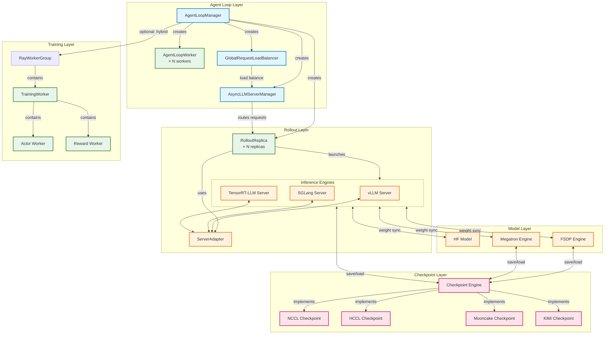

## 组件说明

| 组件                          | 描述                                    |
| ----------------------------- | --------------------------------------- |
| **AgentLoopManager**          | 主管理类，协调所有组件                  |
| **AgentLoopWorker**           | 处理多轮对话的工作器                    |
| **GlobalRequestLoadBalancer** | 全局负载均衡，支持 sticky session       |
| **AsyncLLMServerManager**     | 异步 LLM 服务器管理                     |
| **RolloutReplica**            | 推理服务副本                            |
| **ServerAdapter**             | 各推理引擎的适配器层                    |
| **Checkpoint Engine**         | 模型权重保存/加载引擎                   |
| **TrainingWorker**            | 训练 worker，管理 Actor/Critic/Ref 模型 |

### 部署模式

1. **Hybrid 模式**: 推理和训练共享 GPU
2. **Colocated 模式**: 推理和训练在同一进程组但不同进程
3. **Standalone 模式**: 推理使用独立 GPU 资源


````mermaid
flowchart TB
    subgraph Base["Base Classes"]
        ABC["ABC<br/>(Python Abstract Base Class)"]
        EngineBase["EngineBase<br/>(SGLang)"]
    end

    subgraph RolloutBase["Rollout Layer"]
        BaseRollout["BaseRollout"]
        RolloutReplica["RolloutReplica"]
    end

    subgraph Adapter["Adapter Layer"]
        ServerAdapter["ServerAdapter"]
        HttpServerAdapter["HttpServerAdapter"]
        AsyncHttpServerAdapter["AsyncHttpServerAdapter"]
    end

    subgraph SGLangImpl["SGLang Implementation"]
        SGLangHttpServer["SGLangHttpServer"]
        SGLangReplica["SGLangReplica"]
    end

    %% Inheritance relationships
    ABC --> BaseRollout
    ABC --> RolloutReplica
    EngineBase --> HttpServerAdapter
    BaseRollout --> ServerAdapter
    HttpServerAdapter --> AsyncHttpServerAdapter

    %% Implementation relationships
    RolloutReplica --> SGLangReplica

    %% SGLangReplica creates/manages SGLangHttpServer
    SGLangReplica -.-> |"creates<br/>Ray Actor| SGLangHttpServer

    %% ServerAdapter uses AsyncHttpServerAdapter
    ServerAdapter --> |"uses for<br/>weight sync| AsyncHttpServerAdapter

    %% Styling
    classDef abstract fill:#e3f2fd,stroke:#1565c0,stroke-width:2px,stroke-dasharray: 5 5
    classDef concrete fill:#e8f5e9,stroke:#2e7d32,stroke-width:2px
    classDef external fill:#fff3e0,stroke:#ef6c00,stroke-width:2px

    class BaseRollout,RolloutReplica,HttpServerAdapter abstract
    class ServerAdapter,AsyncHttpServerAdapter,SGLangHttpServer,SGLangReplica concrete
    class ABC,EngineBase external

````


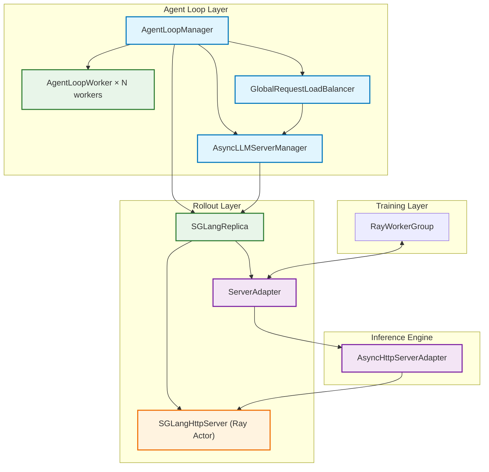


## 流程说明

1. **初始化阶段**：AgentLoopManager 创建 AgentLoopWorker、LoadBalancer、ServerManager 和 SGLangReplica
2. **服务器启动**：SGLangReplica 在每个节点创建 SGLangHttpServer (Ray Actor)
3. **推理请求**：AgentLoopWorker → GlobalRequestLoadBalancer → AsyncLLMServerManager → SGLangReplica → SGLangHttpServer
4. **权重同步**（Hybrid 模式）：训练引擎 → ServerAdapter → AsyncHttpServerAdapter → SGLangHttpServer


| **AgentLoopManager**          | 统一管理整个 Agent Loop 流程，创建 Worker、LoadBalancer、ServerManager 和 RolloutReplica |
| ----------------------------- | ------------------------------------------------------------ |
| **AgentLoopWorker**           | 执行具体的 Agent Loop 逻辑，每个 Worker 处理一批请求         |
| **GlobalRequestLoadBalancer** | 全局负载均衡器，支持 Sticky Session 和 Least Loaded 策略     |
| **AsyncLLMServerManager**     | 管理多个推理服务器，提供请求路由                             |
| **SGLangReplica**             | 管理 SGLang 服务器生命周期，在每个节点创建 `SGLangHttpServer` |
| **SGLangHttpServer**          | 实际的 SGLang 推理服务器（Ray Actor），处理 Token 生成       |
| **ServerAdapter**             | Hybrid 模式下，用于训练引擎和推理服务器之间的权重同步        |
| **AsyncHttpServerAdapter**    | HTTP 客户端，负责与 SGLang 服务器通信                        |


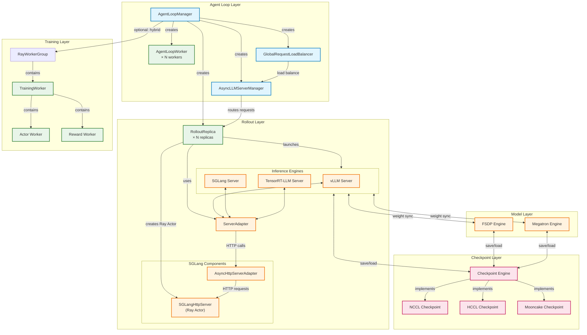

| 层级           | 组件                      | 作用                              |
| -------------- | ------------------------- | --------------------------------- |
| **Agent Loop** | AgentLoopManager          | 统一管理整个 Agent Loop 流程      |
|                | AgentLoopWorker           | 执行具体的 Agent Loop 逻辑        |
|                | GlobalRequestLoadBalancer | 全局负载均衡，支持 Sticky Session |
|                | AsyncLLMServerManager     | 管理多个推理服务器，请求路由      |
| **Rollout**    | RolloutReplica            | 管理推理服务器生命周期            |
|                | SGLangHttpServer          | SGLang 推理服务器 (Ray Actor)     |
|                | ServerAdapter             | Hybrid 模式下训练与推理的权重同步 |
|                | AsyncHttpServerAdapter    | HTTP 客户端，与推理服务器通信     |
| **Training**   | RayWorkerGroup            | 管理训练 Worker                   |
|                | Actor Worker              | 策略模型训练                      |
|                | Reward Worker             | Reward 模型计算                   |
| **Checkpoint** | Checkpoint Engine         | 统一 checkpoint 接口              |
|                | NCCL/HCCL/Mooncake        | 不同通信库的 checkpoint 实现      |
| **Model**      | FSDP/Megatron             | 训练引擎                          |


## 1. 初始化阶段

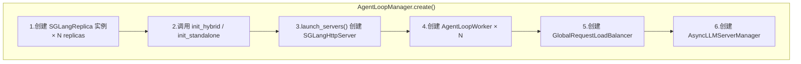

现在我来补充详细的初始化流程：

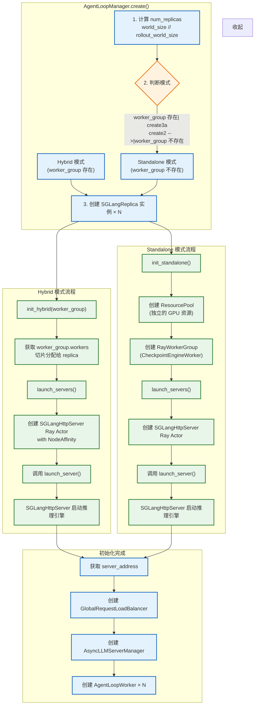

## 详细说明

### Hybrid 模式

| 步骤 | 说明                                                         |
| ---- | ------------------------------------------------------------ |
| 1    | `worker_group` 已存在（与训练引擎共享）                      |
| 2    | `init_hybrid(worker_group)` 获取训练 worker 的引用           |
| 3    | 从 `worker_group.workers` 切片分配给当前 replica             |
| 4    | `launch_servers()` 创建 `SGLangHttpServer` Ray Actor         |
| 5    | **关键**: `workers` 参数传入的是训练 worker，用于 Hybrid 模式下共享进程 |
| 6    | SGLangHttpServer 启动，绑定到 GPU                            |

### Standalone 模式

| 步骤 | 说明                                                      |
| ---- | --------------------------------------------------------- |
| 1    | `worker_group` 不存在，需要独立资源                       |
| 2    | `init_standalone()` 创建新的 **ResourcePool**（独立 GPU） |
| 3    | 创建 **RayWorkerGroup**（使用 `CheckpointEngineWorker`）  |
| 4    | `launch_servers()` 创建 `SGLangHttpServer` Ray Actor      |
| 5    | 推理服务器使用独立 GPU，与训练分离                        |
| 6    | 通过 **Checkpoint Engine (NCCL)** 进行权重同步            |

### ServerAdapter 的角色

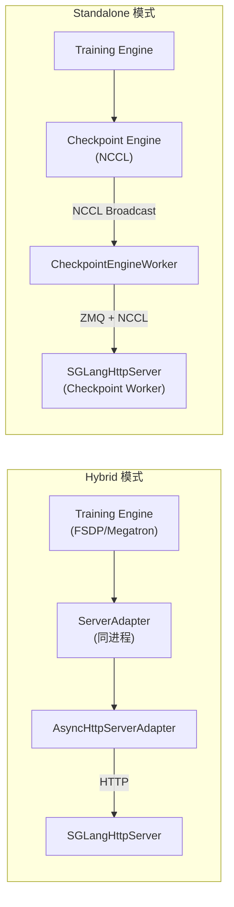

**Hybrid 模式**: `ServerAdapter` 在训练 worker 中运行，通过 HTTP 与 `SGLangHttpServer` 通信

**Standalone 模式**: 不使用 `ServerAdapter`，而是通过独立的 `CheckpointEngineWorker` 和 `NCCLCheckpointEngine` 进行权重同步


### 详细说明

| 步骤 | 操作                           | 说明                                                         |
| ---- | ------------------------------ | ------------------------------------------------------------ |
| 1    | 创建 SGLangReplica             | 根据 `nnodes` × `n_gpus_per_node` 计算 replica 数量          |
| 2    | init_hybrid / init_standalone  | **Hybrid**: 复用训练 worker_group`<br/>`**Standalone**: 创建新的 resource pool 和 worker group |
| 3    | launch_servers()               | 每个 replica 在节点创建 `SGLangHttpServer` Ray Actor         |
| 4    | 创建 AgentLoopWorker           | 每个 Worker 处理一批请求                                     |
| 5    | 创建 GlobalRequestLoadBalancer | Sticky Session + Least Loaded 负载均衡                       |
| 6    | 创建 AsyncLLMServerManager     | 管理服务器地址和请求路由                                     |

------

## 2. 推理请求流程

```
mermaid


flowchart LR
    subgraph Request["推理请求流程"]
        A[AgentLoopWorker] --> B[GlobalRequestLoadBalancer]
        B --> C[AsyncLLMServerManager]
        C --> D[SGLangReplica]
        D --> E[SGLangHttpServer]
    end

收起
```

### 详细说明

1. **AgentLoopWorker**: 执行 Agent Loop 逻辑，生成 prompt 调用 LLM
2. **GlobalRequestLoadBalancer**:
   - **Sticky Session**: 同一 `request_id`（多轮对话）路由到同一服务器（利用 prefix caching）
   - **Least Loaded**: 新请求路由到 inflight 请求最少的服务器
3. **AsyncLLMServerManager**: 根据 server_id 获取对应的 Ray Actor Handle
4. **SGLangReplica**: 持有 `SGLangHttpServer` 的引用
5. **SGLangHttpServer**: 实际执行推理，调用 SGLang Engine 生成 token

------

## 3. 权重同步流程

### 3.1 Hybrid 模式 (HTTP 方式)

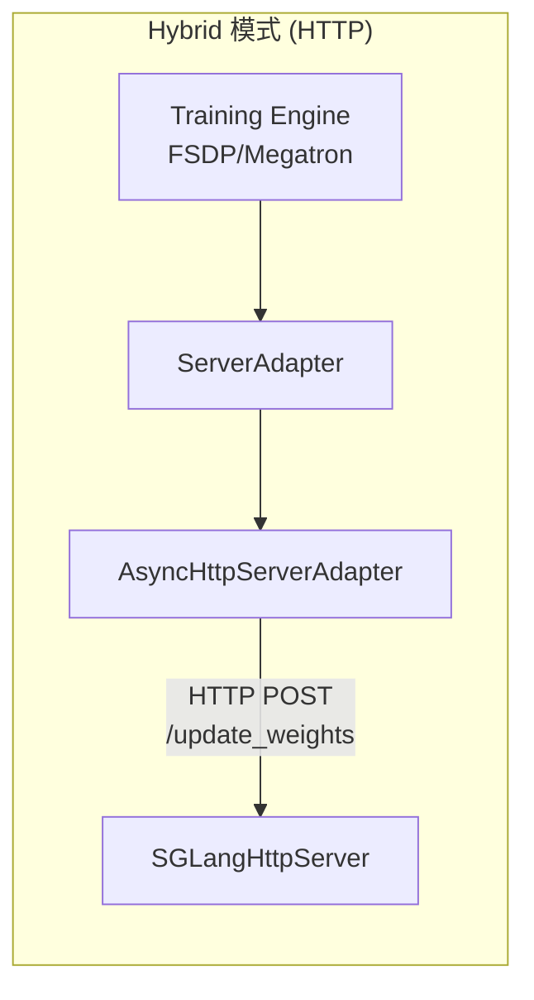

**特点**:

- 训练和推理**共享同一进程**，通过 `device_mesh` 进行通信
- `ServerAdapter` 在训练 worker 中运行
- 权重通过 **HTTP 请求** 传输到推理服务器
- 使用 `AsyncHttpServerAdapter` 作为 HTTP 客户端
- 支持 FP8 量化权重转换

### 3.2 Standalone 模式 (NCCL 方式)

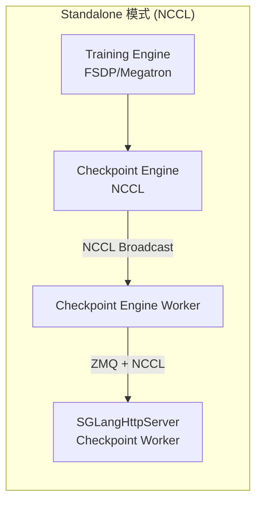

**特点**:

- 训练和推理**独立进程**，使用独立的 GPU 资源
- 通过 **Checkpoint Engine** 进行权重同步
- **NCCLCheckpointEngine**:
  - 使用 **ZMQ** 传递 tensor metadata
  - 使用 **NCCL Broadcast** 在多 GPU 间同步权重
  - 支持 CUDA IPC 加速（如不支持则回退到共享内存）
- `free_cache_engine=True` 时支持 kv cache 释放

### 3.3 Colocated 模式

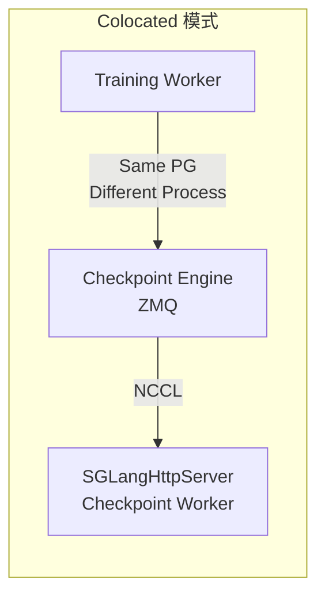

**特点**:

- 训练和推理在**同一个 Ray Placement Group** 但**不同进程**
- 权重同步类似 Standalone 模式
- 不需要 weight sync（进程间无共享内存）

------

## 模式对比

| 模式           | 资源分配       | 权重同步方式                  | 使用场景             |
| -------------- | -------------- | ----------------------------- | -------------------- |
| **Hybrid**     | 共享 GPU       | HTTP (AsyncHttpServerAdapter) | On-policy 训练       |
| **Colocated**  | 同 PG 不同进程 | NCCL/ZMQ (Checkpoint Engine)  | GRM (LLM as a Judge) |
| **Standalone** | 独立 GPU       | NCCL/ZMQ (Checkpoint Engine)  | Off-policy 训练      |


## 类关系图

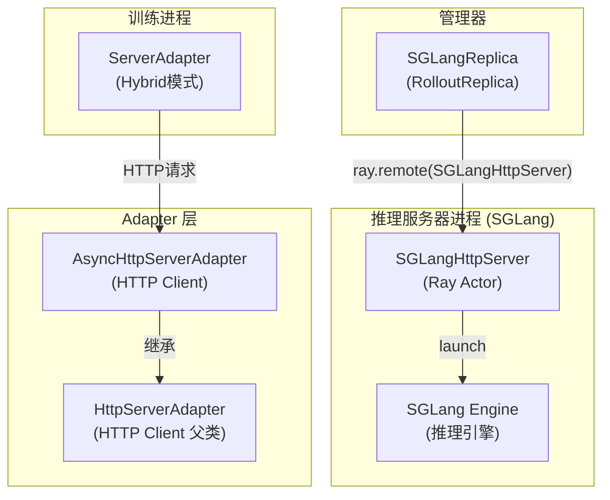

## 详细说明

| 类                         | 位置                      | 作用                                                         |
| -------------------------- | ------------------------- | ------------------------------------------------------------ |
| **SGLangHttpServer**       | **独立的 Ray Actor 进程** | 实际的 SGLang HTTP 服务器，启动和管理 SGLang 推理引擎        |
| **SGLangReplica**          | 控制器                    | 管理 SGLangHttpServer 的生命周期，`ray.remote(SGLangHttpServer)` 创建 Actor |
| **ServerAdapter**          | 训练进程 (Hybrid模式)     | 在训练 worker 中运行，作为 HTTP 客户端与 SGLangHttpServer 通信，进行权重同步 |
| **AsyncHttpServerAdapter** | 训练进程                  | ServerAdapter 使用的 HTTP 客户端，异步版本，继承自 HttpServerAdapter |
| **HttpServerAdapter**      | SGLang 原生               | SGLang 官方的 HTTP 适配器，用于启动服务器进程                |

## 分进程实现机制

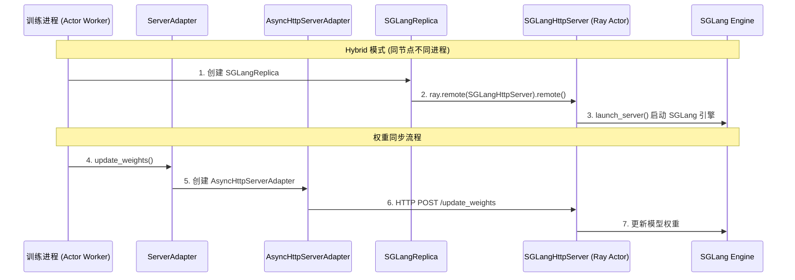

### 关键点

1. **SGLangHttpServer 是实际的 Server**：它是一个 **Ray Actor**，运行在独立进程中
   - 通过 `ray.remote(SGLangHttpServer)` 创建
   - 内部调用 `sglang.srt.entrypoints.http_server.launch_server()` 启动推理引擎
2. **分进程机制**：
   - **Hybrid 模式**：训练进程和推理进程在**同一节点**，通过 `ServerAdapter` + `AsyncHttpServerAdapter` 进行 HTTP 通信
   - **Standalone 模式**：推理进程有独立的 GPU 资源
3. **ServerAdapter 的作用**：
   - 在 **Hybrid 模式**下运行在训练 worker 进程中
   - 持有 `AsyncHttpServerAdapter` 实例
   - 通过 HTTP 请求与 `SGLangHttpServer` 通信完成权重同步