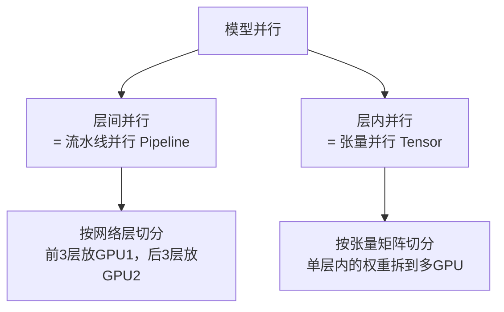
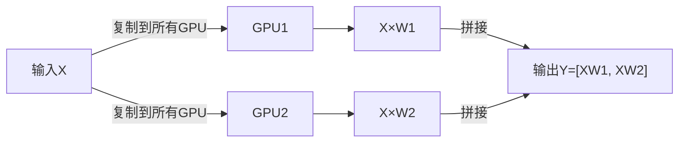
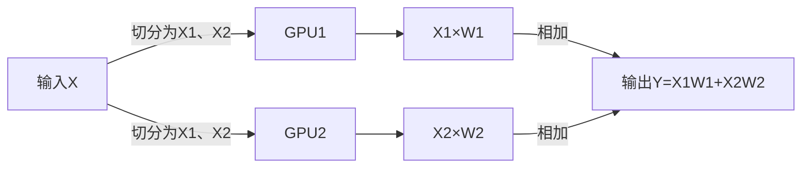
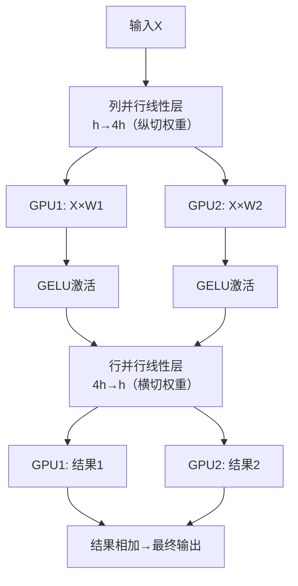
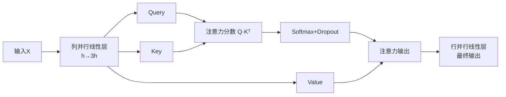
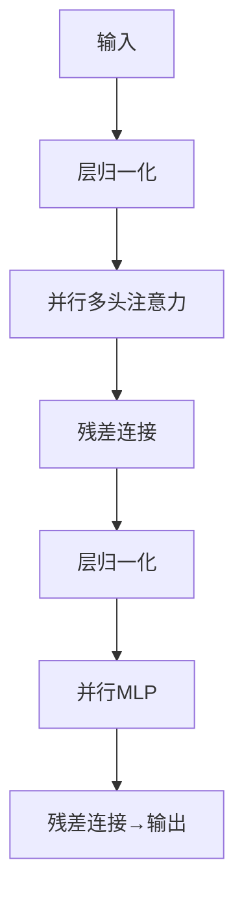

# 一文通俗读懂：Megatron 大模型张量并行原理与实现

这篇文章是对**NVIDIA Megatron-LM**（多机多卡训练超大规模 Transformer 模型的开源框架）的论文 + 代码拆解，核心讲清：**超大模型如何拆到多张 GPU 上训练，且尽量少通信、高效率**。

我把原文的复杂表述、零散代码、晦涩概念重新梳理，用通俗语言 + Mermaid 示意图讲透核心逻辑。

***

## 一、文章核心背景

GPT-3 这类千亿参数大模型，单张 GPU 根本装不下，必须用**多机 + 多 GPU**并行训练。

Megatron-LM 的核心贡献：

1. 搞定**三种正交并行**：数据并行、张量并行（层内）、流水线并行（层间）；

2. 重点拆解**张量并行**：把单层 Transformer 的矩阵拆到多 GPU，不损失精度、减少通信；

3. 给出 MLP、多头自注意力的具体并行实现，直接对应源码逻辑。

***

## 二、先搞懂 3 个基础概念

### 1. 两种模型并行（核心区分）

* **流水线并行**：纵向切网络，层与层分到不同 GPU；

* **张量并行**：横向切单层内的张量 / 矩阵，是 Megatron 的核心。

### 2. 正交互补

张量并行、流水线并行、数据并行**互不冲突、可叠加使用**，就像横向、纵向、斜向切蛋糕，互不影响。

### 3. 算力效率（GPU 利用率）

公式：

$ 
\text{算力效率} = \frac{\text{多GPU总算力}}{\text{单GPU算力} \times \text{GPU总数}}
 $

原文案例：512 张 V100，效率≈75.6%，代表并行方案的高效性。

***

## 三、张量并行基础：两种线性层切法

Transformer 的核心是**线性层（矩阵乘法）**，Megatron 先把最简单的 $Y=XW$ 拆成两种并行方式，这是所有模块的基础。

### 1. 列并行线性层（纵切权重 W）

把权重矩阵**纵向切分**，输入 X 直接复制到所有 GPU，输出按维度拼接。

* 前向：复制输入 → 分头计算 → 拼接输出；

* 反向：梯度切割 → 分头回传 → 梯度归约。

### 2. 行并行线性层（横切权重 W）

把权重矩阵**横向切分**，输入 X 按维度拆分，输出结果相加。

* 前向：切割输入 → 分头计算 → 结果求和；

* 反向：梯度复制 → 分头回传。

***

## 四、MLP 模块的张量并行实现

Transformer 的 MLP 结构：$X \to \text{线性层1} \to \text{激活函数} \to \text{线性层2} \to \text{输出}$

维度变化：$h \to 4h \to h$

### 核心原则

1. **第一层线性层：用列并行（纵切）**

   激活函数（GELU/ReLU）是非线性的，必须先算完激活再拼接，**无额外通信开销**；

2. **第二层线性层：用行并行（横切）**

   输入已被拆分，直接分头计算，最后求和输出。

### MLP 并行完整流程

***

## 五、多头自注意力的张量并行实现

注意力核心流程：$X \to Q/K/V \to \text{注意力分数} \to \text{Softmax} \to \text{输出线性层}$

### 并行逻辑（全复用前面的线性层）

1. **Q/K/V 生成：列并行**

   用一个`h→3h`的列并行线性层，直接拆出 Q、K、V；

2. **注意力计算：单 GPU 内完成**

   每个 GPU 只算自己分到的头，不跨 GPU 通信；

3. **输出线性层：行并行**

   最后用行并行线性层拼接结果。

### 注意力并行流程

***

## 六、完整 Transformer 层 & 流水线并行

### 1. 单层并行 Transformer 结构

把**并行注意力 + 并行 MLP + 层归一化 + 残差连接**组合：

***

## 七、代码核心精简总结

1. **列并行线性层**：`ColumnParallelLinear` → 输入复制、输出拼接；

2. **行并行线性层**：`RowParallelLinear` → 输入切割、输出求和；

3. **并行 MLP**：先列并行、后行并行，中间加激活；

4. **并行注意力**：Q/K/V 用列并行，输出用行并行；

5. **整体框架**：张量并行（层内）+ 流水线并行（层间）+ 数据并行，三者叠加训练超大模型。

***

## 极简核心口诀

> 线性层分两种：纵切列并行、横切行并行

MLP：先列后行，激活无通信

注意力：QKV 列并行，输出行并行

张量 + 流水线 + 数据，三并行撑千亿模型
