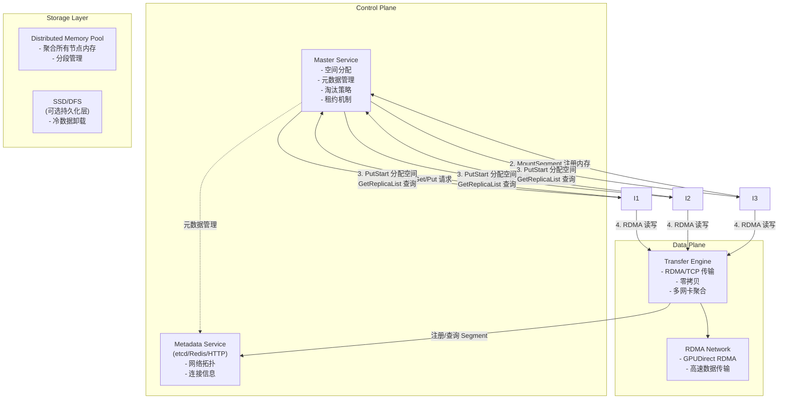
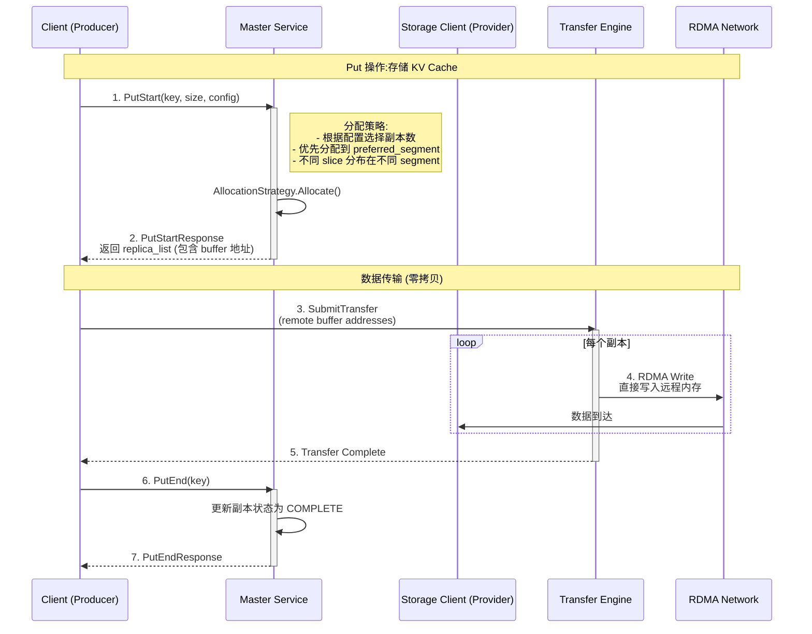
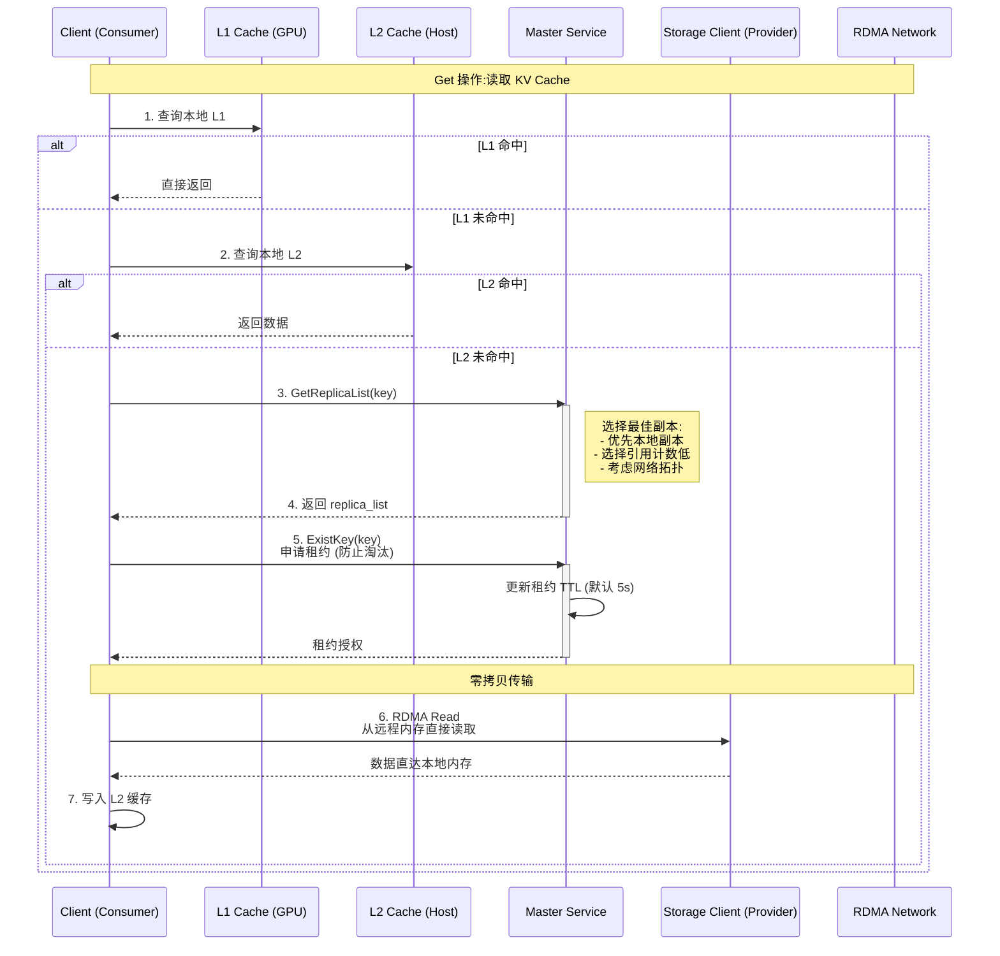
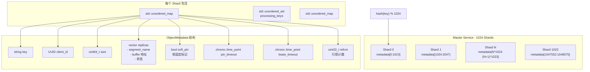
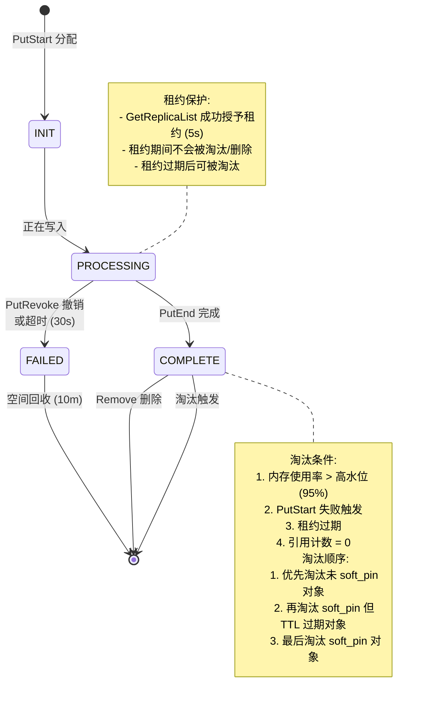
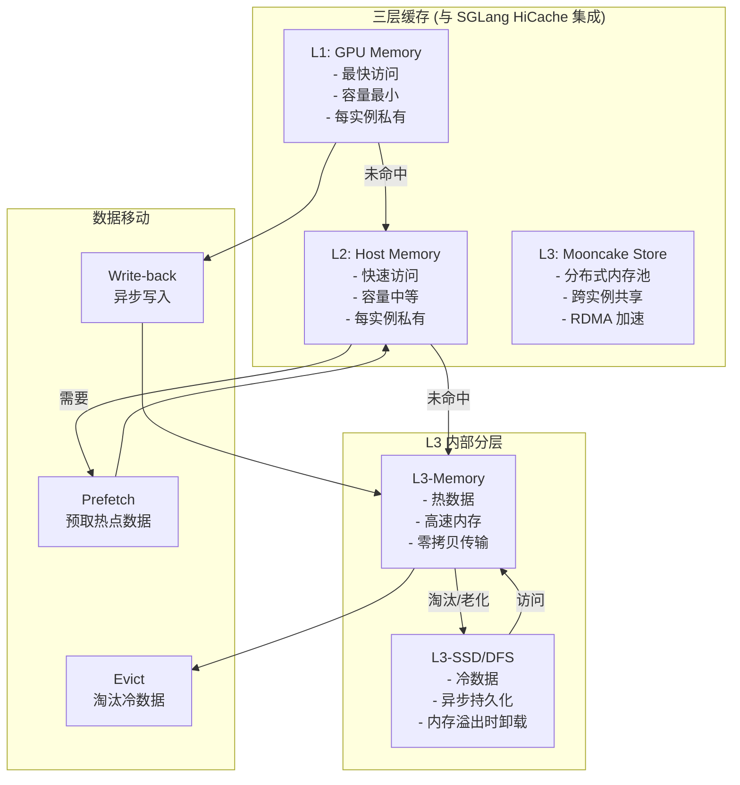
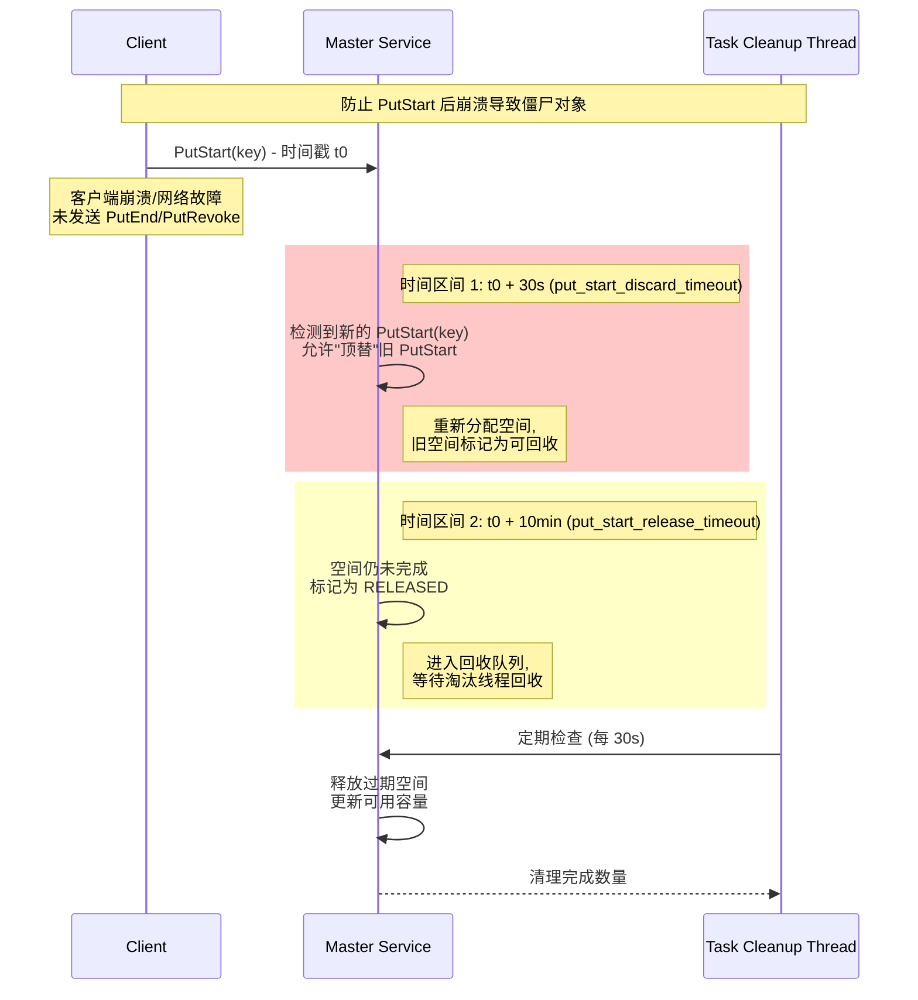

# Mooncake 全局 KV Cache 工作机制详解

## **Mooncake 全局 KV Cache 工作机制详解**

Mooncake 全局 KV Cache 是一个分布式键值缓存存储引擎，专为 LLM 推理场景设计。它将集群中所有节点的内存聚合为一个巨大的分布式内存池,实现 KV cache 的跨实例共享和高效访问。


### **整体架构**


graph TB
    subgraph "Inference Nodes"
        I1["Client 1<br/>(Prefill Node)<br/>Local: GPU + Host Memory<br/>Global: 0GB"]
        I2["Client 2<br/>(Decode Node)<br/>Local: GPU + Host Memory<br/>Global: 0GB"]
        I3["Client 3<br/>(Storage Node)<br/>Local: None<br/>Global: 60GB"]
    end
    




### **核心工作流程**

#### **1. 写入流程**



#### **2. 读取流程**



### **元数据管理与一致性**



### **淘汰策略与租约机制**



### **分层存储架构**



### **僵尸对象清理机制**



### **关键特性总结**

1. 零拷贝传输:基于 Transfer Engine,通过 RDMA 直接在远程内存和本地内存间传输,完全绕过 CPU
2. 控制流与数据流分离:Master Service 仅管理元数据,实际数据传输直接在不同 Client 之间进行
3. 副本管理:支持多副本,同一对象的不同 slice 保证分布在不同 segment,尽力而为分配
4. 强一致性:Get 操作保证返回完整正确的数据,Put 后数据不可变
5. 容错能力:任意数量 Master 和 Client 故障都不会读到错误数据,只要有至少一个 Master 和 Client 正常运行
6. 软固定机制:重要对象(如 system prompt)可软固定,淘汰时优先保留,长时间未访问自动解除
7. 分级存储:支持内存到 SSD 的分层缓存,异步持久化,平衡性能与成本

这个架构使 Mooncake 能够在大规模 LLM 推理场景中,提供 virtually unlimited 的 KV cache 容量,同时保持高带宽、低延迟的数据访问性能。


```
mooncake_master \
  --enable_http_metadata_server=true \
  --http_metadata_server_host=0.0.0.0 \
  --http_metadata_server_port=44407
```


## Mooncake Master 功能讲解

Mooncake Master 是 Mooncake 分布式存储系统的核心协调服务，负责管理元数据和协调存储节点。

### 核心功能

| 功能             | 说明                                           |
| ---------------- | ---------------------------------------------- |
| **RPC 服务**     | 提供 gRPC 风格的服务，处理客户端的 KV 操作请求 |
| **元数据管理**   | 存储和管理键值对的元数据信息                   |
| **存储后端管理** | 支持多种内存分配器（cachelib、offset）         |
| **缓存策略**     | 支持软钉住（soft pin）对象的淘汰策略           |
| **任务管理**     | 管理 Put/Get 任务的执行和超时                  |

### 启动参数分类

#### 1. **RPC 服务配置**

```
DEFINE_int32(rpc_port, 0, "RPC 服务器端口");
DEFINE_int32(rpc_thread_num, 0, "RPC 线程数");
DEFINE_string(rpc_address, "0.0.0.0", "绑定地址");
DEFINE_bool(rpc_enable_tcp_no_delay, true, "禁用 Nagle's 算法");
```

#### 2. **元数据服务器配置**

```
DEFINE_bool(enable_http_metadata_server, false, "启用 HTTP 元数据服务器");
DEFINE_int32(http_metadata_server_port, 8080, "HTTP 元数据服务器端口");
DEFINE_string(http_metadata_server_host, "0.0.0.0", "HTTP 绑定地址");
```

#### 3. **高可用配置 (HA)**

```
DEFINE_bool(enable_ha, false, "启用高可用模式");
DEFINE_string(etcd_endpoints, "", "etcd 集群地址");
DEFINE_string(cluster_id, "", "集群 ID");
DEFINE_int64(client_ttl, ..., "客户端存活超时时间");
```

#### 4. **存储后端配置**

```
DEFINE_string(memory_allocator, "offset", "内存分配器: cachelib | offset");
DEFINE_bool(enable_cxl, false, "启用 CXL 内存支持");
DEFINE_string(cxl_path, ..., "CXL 设备路径");
DEFINE_uint64(cxl_size, ..., "CXL 内存大小");
DEFINE_bool(enable_disk_eviction, true, "启用磁盘淘汰");
DEFINE_double(eviction_ratio, ..., "淘汰比例");
```

#### 5. **KV 生命周期配置**

```
DEFINE_uint64(default_kv_lease_ttl, ..., "KV 租约默认 TTL");
DEFINE_uint64(default_kv_soft_pin_ttl, ..., "软钉住对象 TTL");
DEFINE_bool(allow_evict_soft_pinned_objects, ..., "是否允许淘汰软钉住对象");
```

#### 6. **监控指标**

```
DEFINE_bool(enable_metric_reporting, true, "启用指标上报");
DEFINE_int32(metrics_port, 9003, "指标 HTTP 服务器端口");
```

### 主流程 ([main](file:///Users/arron/Projects/Mooncake/mooncake-store/src/master.cpp#478#4) 函数)

```
int main(int argc, char* argv[]) {
    // 1. 解析命令行参数
    gflags::ParseCommandLineFlags(&argc, &argv, true);
    
    // 2. 初始化配置（从文件 + 命令行）
    LoadConfigFromCmdline(master_config, ...);
    
    // 3. 启动 HTTP 元数据服务器（如果启用）
    if (master_config.enable_http_metadata_server) {
        StartHttpMetadataServer(...);
    }
    
    // 4. 启动 RPC 服务
    if (master_config.enable_ha) {
        // HA 模式：启动 MasterServiceSupervisor
        supervisor.Start();
    } else {
        // 非 HA 模式：直接启动 RPC 服务器
        coro_rpc::coro_rpc_server server(...);
        mooncake::RegisterRpcService(server, wrapped_master_service);
        server.start();
    }
}
```

### 架构定位

```
┌─────────────────────────────────────────────────────┐
│                    Client                            │
└───────────────────┬─────────────────────────────────┘
                    │ RPC 请求
                    ▼
┌─────────────────────────────────────────────────────┐
│              Mooncake Master                         │
│  ┌─────────────────────────────────────────────────┐│
│  │  • 元数据管理                                   ││
│  │  • 路由决策                                     ││
│  │  • 负载均衡                                     ││
│  │  • 故障检测                                     ││
│  └─────────────────────────────────────────────────┘│
└───────────────────┬─────────────────────────────────┘
                    │
        ┌───────────┼───────────┐
        ▼           ▼           ▼
┌───────────┐ ┌───────────┐ ┌───────────┐
│  Store 1  │ │ Store 2   │ │ Store N   │
│  (RDMA)   │ │  (TCP)    │ │  (NVLink) │
└───────────┘ └───────────┘ └───────────┘
```

Mooncake 是一个类似 Redis / Memcached 的分布式缓存系统，但针对 **RDMA / NVLink** 等高速互连进行了优化，支持更高效的远程内存访问。


https://kvcache-ai.github.io/Mooncake/design/mooncake-store.html