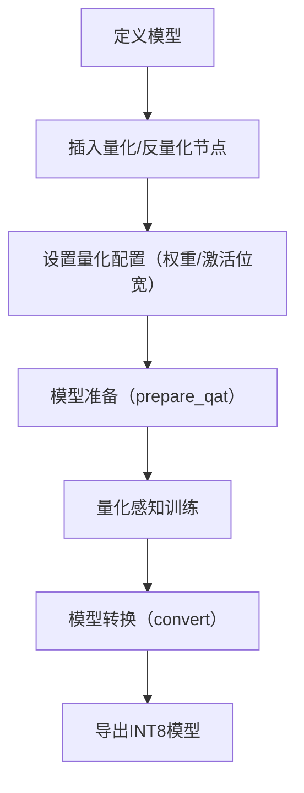

# PyTorch Autograd 与 torch.autograd.Function 详解

### 1. PyTorch Autograd 机制 & `torch.autograd.Function`

#### Autograd 实现原理

Autograd 是 PyTorch 自动求导的核心，基于**计算图（动态图）** 实现：

1. **追踪计算**：Tensor 设置 `requires_grad=True` 时，PyTorch 会记录所有对该 Tensor 的操作，构建以 Tensor 为节点、操作为边的动态计算图；

2. **反向传播**：调用 `backward()` 时，从损失函数节点出发，沿计算图反向遍历，根据链式法则计算梯度；

3. **梯度缓存**：梯度会累积到 Tensor 的 `.grad` 属性中，`grad_fn` 属性记录生成该 Tensor 的操作（即反向传播的入口）。

#### `torch.autograd.Function` 工作原理

`Function` 是 Autograd 的核心基类，自定义求导逻辑必须继承它，需实现两个核心方法：

- `forward(ctx, *args)`：前向传播逻辑，`ctx` 用于存储中间结果（供反向传播使用），返回输出 Tensor；

- `backward(ctx, *grad_outputs)`：反向传播逻辑，接收上游梯度 `grad_outputs`，结合 `ctx` 中存储的前向数据，计算并返回输入 Tensor 的梯度。

**示例**：

```Python

import torch

class MyReLU(torch.autograd.Function):
    @staticmethod
    def forward(ctx, x):
        ctx.save_for_backward(x)  # 保存前向数据
        return x.clamp(min=0)
    
    @staticmethod
    def backward(ctx, grad_output):
        x, = ctx.saved_tensors  # 读取前向数据
        grad_x = grad_output.clone()
        grad_x[x < 0] = 0  # ReLU 反向梯度
        return grad_x

# 使用
x = torch.tensor([-1.0, 2.0], requires_grad=True)
relu = MyReLU.apply  # Function 需通过 apply 调用
y = relu(x)
y.sum().backward()
print(x.grad)  # tensor([0., 1.])
```

### 2. `nn.Module` 的 `__call__` vs `forward`

#### 核心区别

|方法|作用|
|---|---|
|`forward`|定义模型**纯前向计算逻辑**，用户需重写该方法实现自定义模型|
|`__call__`|Module 的内置方法（继承自 `torch.nn.Module`），是调用实例时的入口，**封装了 ** **`forward`**|
#### 设计原因

`__call__` 除了调用 `forward`，还会触发额外关键逻辑：

1. 执行 `forward_pre_hook`/`forward_hook`（前向钩子）；

2. 记录计算图（用于 Autograd）；

3. 处理 `nn.Module` 的 `training` 模式（区分训练/评估）；

4. 执行 `backward_hook`（反向钩子）。

**本质**：`forward` 只负责计算，`__call__` 负责整合“计算+框架级功能（钩子、求导、模式管理）”，解耦用户逻辑与框架内置逻辑。

### 3. PyTorch Dispatch 机制 & 核心模块

#### Dispatch 机制

Dispatch（分发）是 PyTorch 底层核心，负责将 Python 层的算子调用（如 `torch.add`）路由到具体的实现（CPU/CUDA/量化/稀疏等版本），核心是**算子重载与多设备适配**。

#### 核心模块职责

|模块|核心作用|
|---|---|
|`ATen`|PyTorch 核心张量库，定义了所有基础算子（如 `aten::add`）的接口和默认实现，是 Dispatch 的基础|
|`c10`|PyTorch 的核心 C++ 库，提供 Dispatch 机制的核心框架（如 `DispatchKey` 分发键、算子注册逻辑）|
|`torch.library`|PyTorch 1.10+ 新增的 Python 层 API，用于注册/扩展自定义算子，简化 Dispatch 流程，无需修改 C++ 源码|
### 4. 自定义 CUDA 算子 & PyTorch 调用（详细步骤）

#### 整体流程

1. **编写 CUDA 核函数**（`.cu` 文件）：实现算子的 GPU 并行逻辑；

2. **编写 C++ 绑定层**：封装 CUDA 核函数，适配 PyTorch 的 ATen 接口；

3. **编译为动态库**（`.so`/`.pyd`）：使用 `setuptools` 或 `cmake` 编译；

4. **Python 绑定调用**：通过 `torch.utils.cpp_extension` 加载动态库，封装为可调用函数。

#### 详细步骤

##### 步骤 1：编写 CUDA 代码（`my_cuda_op.cu`）

```C++

#include <torch/extension.h>
#include <cuda.h>
#include <cuda_runtime.h>

// CUDA 核函数：逐元素加 1
template <typename T>
__global__ void add_one_kernel(T* input, T* output, int n) {
    int idx = blockIdx.x * blockDim.x + threadIdx.x;
    if (idx < n) {
        output[idx] = input[idx] + 1.0f;
    }
}

// C++ 接口：封装核函数调用
torch::Tensor add_one_cuda(torch::Tensor input) {
    TORCH_CHECK(input.is_cuda(), "Input must be CUDA tensor");
    auto output = torch::empty_like(input);
    int n = input.numel();
    int block_size = 256;
    int grid_size = (n + block_size - 1) / block_size;
    
    AT_DISPATCH_FLOATING_TYPES(input.scalar_type(), "add_one_cuda", ([&] {
        add_one_kernel<scalar_t><<<grid_size, block_size>>>(
            input.data_ptr<scalar_t>(),
            output.data_ptr<scalar_t>(),
            n
        );
    }));
    return output;
}

// 绑定到 Python 模块
PYBIND11_MODULE(TORCH_EXTENSION_NAME, m) {
    m.def("add_one", &add_one_cuda, "Add one to tensor (CUDA)");
}
```

##### 步骤 2：编译脚本（`setup.py`）

```Python

from setuptools import setup
from torch.utils.cpp_extension import BuildExtension, CUDAExtension

setup(
    name='my_cuda_op',
    ext_modules=[
        CUDAExtension(
            'my_cuda_op',
            sources=['my_cuda_op.cu'],
            extra_compile_args={'nvcc': ['-O2']}  # 编译优化
        )
    ],
    cmdclass={
        'build_ext': BuildExtension
    }
)
```

##### 步骤 3：编译并安装

```Bash

python setup.py install  # 生成动态库
```

##### 步骤 4：Python 调用

```Python

import torch
import my_cuda_op

x = torch.tensor([1.0, 2.0, 3.0]).cuda()
y = my_cuda_op.add_one(x)
print(y)  # tensor([2., 3., 4.], device='cuda:0')
```

### 5. PyTorch 内存池（Caching Allocator）& 显存碎片优化

#### 内存池策略

PyTorch 的 Caching Allocator 是 GPU 显存管理的核心，核心逻辑：

1. **预分配与缓存**：首次申请显存时，向 CUDA 驱动申请大块显存，后续小申请直接从缓存池分配，避免频繁调用 `cudaMalloc`/`cudaFree`（开销大）；

2. **延迟释放**：`torch.cuda.empty_cache()` 前，释放的 Tensor 显存不会归还给显卡驱动，而是保留在缓存池；

3. **分块管理**：缓存池按显存块大小分类（如小块 < 1MB、中块 1-10MB、大块 >10MB），减少碎片。

#### 分析 & 优化显存碎片

##### 分析工具

- `torch.cuda.memory_summary()`：打印显存使用详情（缓存池大小、碎片率）；

- `nvidia-smi`：查看显卡总显存使用；

- `torch.cuda.memory_snapshot()`：生成显存快照，可视化碎片（需 `torch>=1.10`）。

##### 优化方法

1. **减少小张量频繁创建/销毁**：复用 Tensor、使用 `torch.zeros_like` 替代 `torch.zeros`；

2. **显式清理缓存**：训练 epoch 间隙调用 `torch.cuda.empty_cache()`（谨慎使用，避免缓存失效）；

3. **调整内存池策略**：设置 `TORCH_CUDNN_V8_API_ENABLED=1`、`PYTORCH_CUDA_ALLOC_CONF=expandable_segments:True`（PyTorch 2.0+）；

4. **使用梯度检查点**：减少前向缓存的中间张量；

5. **按大小排序数据**：DataLoader 中按批次张量大小排序，减少内存池频繁扩容/收缩。

### 6. `torch.jit.trace` vs `torch.jit.script`

#### 核心区别

|特性|`torch.jit.trace`|`torch.jit.script`|
|---|---|---|
|原理|执行一次模型，记录张量操作轨迹，生成静态图|直接解析 Python 代码，编译为 TorchScript 静态图|
|支持控制流|不支持（如 if/for 会固化为执行轨迹）|支持完整 Python 控制流|
|支持动态结构|不支持（如动态形状、条件分支）|支持（需符合 TorchScript 语法）|
|适用场景|纯张量操作、无控制流的简单模型|含控制流、动态逻辑的复杂模型（如检测/分割）|
#### 失败场景

- `trace` 失败：模型含 `if/for` 动态分支、依赖 Tensor 形状判断、使用 Python 原生函数（如 `len`）；

- `script` 失败：使用 TorchScript 不支持的 Python 特性（如 lambda、生成器、动态类属性）、调用未封装的第三方库。

**示例**：

```Python

import torch

class MyModel(torch.nn.Module):
    def forward(self, x):
        if x.sum() > 0:  # 控制流
            return x * 2
        return x / 2

model = MyModel()
x = torch.tensor([1.0])

# trace 会固化轨迹（仅记录 x.sum()>0 的分支）
traced = torch.jit.trace(model, x)
print(traced(torch.tensor([-1.0])))  # 错误：仍输出 -2.0 而非 -0.5

# script 正确解析控制流
scripted = torch.jit.script(model)
print(scripted(torch.tensor([-1.0])))  # 正确输出 -0.5
```

### 7. `DataLoader` `num_workers` 设置 & `too many open files`

#### `num_workers` 最优值

`num_workers` 是数据加载的子进程数，设置原则：

1. **基础值**：`CPU 核心数 - 1` 或 `GPU 数量 * 4`（避免 CPU 过载）；

2. **上限**：通常不超过 32（过多会导致进程间通信开销）；

3. **调试**：从 0（主线程加载）开始逐步增加，监控 GPU 利用率（GPU 利用率稳定后停止增加）。

#### `too many open files` 问题

##### 原因

- 每个 worker 进程会打开文件（如图片、数据文件），系统默认文件句柄数限制（通常 1024）被突破；

- worker 进程未正确关闭文件句柄（如数据集类未释放资源）。

##### 解决方案

1. **临时提升系统文件句柄限制**：

    ```Bash
    
    ulimit -n 65535  # 临时生效，重启终端失效
    ```

2. **永久修改（Linux）**：编辑 `/etc/security/limits.conf`，添加：

    ```Plain Text
    
    * soft nofile 65535
    * hard nofile 65535
    ```

3. **优化 DataLoader**：

    - 设置 `persistent_workers=True`（复用 worker 进程，减少重复创建/销毁）；

    - 在数据集 `__getitem__` 中显式关闭文件句柄；

    - 降低 `num_workers`。

### 8. `DDP` vs `FSDP`（分布式训练）

|特性|DDP (Distributed Data Parallel)|FSDP (Fully Sharded Data Parallel)|
|---|---|---|
|显存占用|每个进程保存完整模型参数/梯度/优化器状态|模型参数/梯度/优化器状态按层分片，显存占用≈1/进程数|
|通信方式|梯度 AllReduce（进程间同步梯度）|参数 Shard + 梯度 AllReduce + 参数重分片|
|适用场景|中小型模型（单卡可放下完整模型）|超大模型（单卡无法放下完整模型，如千亿参数）|
|实现复杂度|低（只需包装模型）|高（需配置分片策略、混合精度等）|
|通信开销|低（仅梯度同步）|高（参数分片/重分片增加通信）|
### 9. PyTorch 2.0 `torch.compile` 技术栈

`torch.compile` 是 PyTorch 2.0 核心优化，底层由三大组件协同：

1. **TorchDynamo**：

    - 作用：Python 字节码级捕获模型前向计算图，避免 Autograd 追踪开销，识别可优化的计算子图；

    - 特点：非侵入式，不修改模型代码，兼容原生 PyTorch 语法。

2. **AOTAutograd**：

    - 作用：提前（Ahead-of-Time）计算反向传播图，将前向+反向图整合为静态图，消除动态图的运行时开销；

    - 特点：支持自动微分的静态编译。

3. **Inductor**：

    - 作用：将静态图编译为高效的 CPU/GPU 代码（如 CUDA 核函数、CPU 向量化指令），替代传统的 ATen 算子调用；

    - 特点：支持自动融合算子、内存优化，提升执行效率。

### 10. 调试 CUDA Kernel Launch 失败 & `CUDA_LAUNCH_BLOCKING=1`

#### 调试步骤

1. **启用阻塞启动**：设置环境变量 `CUDA_LAUNCH_BLOCKING=1`；

2. **打印核函数参数**：检查 grid/block 大小、Tensor 维度是否合法；

3. **检查显存**：使用 `torch.cuda.memory_allocated()` 确认显存充足；

4. **编译调试版本**：CUDA 编译时添加 `-G -g` 选项，使用 `cuda-gdb` 调试。

#### `CUDA_LAUNCH_BLOCKING=1` 原理

- 默认：CUDA Kernel 是异步启动（CPU 发起后立即返回，不等待 Kernel 执行完成），Kernel 错误会延迟上报，难以定位；

- 启用后：Kernel 变为同步启动（CPU 等待 Kernel 执行完成后再返回），错误会立即抛出，且报错信息会指向具体的 Kernel 调用行，方便定位。

### 11. PyTorch Hook 机制 & 应用场景

#### 核心 Hook 类型

|Hook 类型|触发时机|作用|
|---|---|---|
|`forward_pre_hook`|`forward` 执行前|修改输入、检查输入合法性、记录输入数据|
|`forward_hook`|`forward` 执行后|修改输出、记录中间特征、计算特征图统计信息（如均值/方差）|
|`backward_hook`|反向传播时|修改梯度、检查梯度异常（如 NaN/Inf）、梯度裁剪|
|`register_full_backward_hook`|反向传播完整执行后|避免 `backward_hook` 的梯度覆盖问题，PyTorch 1.8+ 推荐使用|
#### 应用场景

- `forward_pre_hook`：输入数据归一化、输入维度检查；

- `backward_hook`：梯度监控（如检测梯度消失/爆炸）、梯度替换（如对抗训练）。

**示例**：

```Python

import torch.nn as nn

model = nn.Linear(10, 1)

# forward_hook 记录输出
def forward_hook(module, input, output):
    print(f"Module output: {output.shape}")

model.register_forward_hook(forward_hook)

# backward_hook 检查梯度
def backward_hook(module, grad_input, grad_output):
    if torch.isnan(grad_input[0]).any():
        print("NaN in gradient!")
    return grad_input

model.register_backward_hook(backward_hook)

x = torch.randn(2, 10, requires_grad=True)
y = model(x)
y.sum().backward()
```

### 12. 量化感知训练（QAT）& `torch.ao.quantization` 流程

#### QAT 核心原理

量化感知训练（QAT）：在训练过程中模拟量化误差（如权重/激活的舍入、缩放），使模型适应量化后的精度损失，最终导出低精度模型（如 INT8）。

#### `torch.ao.quantization` 工作流


**代码示例**：

```Python

import torch
import torch.nn as nn
import torch.ao.quantization as quant

# 1. 定义模型
class MyModel(nn.Module):
    def __init__(self):
        super().__init__()
        self.conv = nn.Conv2d(3, 16, 3)
        self.relu = nn.ReLU()
    
    def forward(self, x):
        return self.relu(self.conv(x))

# 2. 插入量化节点（QAT需用QuantWrapper）
model = quant.QuantWrapper(MyModel())

# 3. 设置量化配置
model.qconfig = quant.get_default_qat_qconfig('fbgemm')

# 4. 模型准备
quant.prepare_qat(model, inplace=True)

# 5. 量化感知训练（常规训练流程）
optimizer = torch.optim.SGD(model.parameters(), lr=0.01)
for _ in range(100):
    x = torch.randn(1, 3, 32, 32)
    y = model(x)
    loss = y.sum()
    loss.backward()
    optimizer.step()

# 6. 转换为量化模型
model.eval()
quantized_model = quant.convert(model, inplace=False)

# 7. 推理
x = torch.randn(1, 3, 32, 32)
output = quantized_model(x)
print(output.dtype)  # torch.quint8（权重）/ torch.float32（输出）
```

### 13. 梯度检查点（Checkpoint）& 显存/计算权衡

#### 显存节省原理

梯度检查点通过**牺牲计算量换显存**：

1. 常规训练：前向传播保存所有中间张量，反向传播时用这些张量计算梯度（显存占用高）；

2. 检查点：前向传播时不保存中间张量（仅保存输入），反向传播时**重新计算**中间张量，再计算梯度（显存占用降低，计算量增加）。

#### 计算开销

- 反向传播时需重新执行检查点包裹的前向计算，总计算量增加约 20%-50%；

- 适用于中间张量多的模型（如 Transformer、ResNet 深层），显存节省可达 30%-70%。

**示例**：

```Python

import torch
import torch.nn as nn
from torch.utils.checkpoint import checkpoint

class DeepModel(nn.Module):
    def __init__(self):
        super().__init__()
        self.layers = nn.Sequential(*[nn.Linear(1024, 1024) for _ in range(100)])
    
    def forward(self, x):
        # 用 checkpoint 包裹计算密集的层
        return checkpoint(self.layers, x)  # 反向时重新计算 self.layers

model = DeepModel().cuda()
x = torch.randn(128, 1024).cuda()
y = model(x)
y.sum().backward()  # 显存占用远低于常规训练
```

### 14. `torch.cuda.amp` 自动混合精度（AMP）& `GradScaler` 跳过更新

#### AMP 核心原理

自动混合精度训练：

1. 部分算子（如卷积、矩阵乘法）使用 FP16 计算（速度快、显存省）；

2. 部分算子（如 BatchNorm、Softmax）使用 FP32 计算（避免精度损失）；

3. 梯度缩放（GradScaler）：FP16 梯度易下溢，将梯度放大若干倍，反向后再缩放回来。

#### `GradScaler` 跳过更新的场景

`GradScaler.step(optimizer)` 会检查梯度是否异常（如 NaN/Inf），若存在：

1. 跳过本次参数更新；

2. 降低缩放因子（scale），避免后续再次出现梯度异常；

3. 待梯度恢复正常后，恢复缩放因子。

**示例**：

```Python

import torch
import torch.nn as nn
from torch.cuda.amp import autocast, GradScaler

model = nn.Linear(10, 1).cuda()
optimizer = torch.optim.SGD(model.parameters(), lr=0.01)
scaler = GradScaler()

for _ in range(100):
    x = torch.randn(128, 10).cuda()
    with autocast():  # 自动混合精度上下文
        y = model(x)
        loss = y.sum()
    
    # 反向传播（梯度缩放）
    scaler.scale(loss).backward()
    
    # 梯度更新（自动检查梯度异常）
    scaler.step(optimizer)
    scaler.update()  # 更新缩放因子
```

### 15. PyTorch 性能分析 & `torch.profiler`/`nvprof`

#### 核心工具使用

##### 1. `torch.profiler`（PyTorch 内置）

```Python

import torch
import torch.nn as nn
from torch.profiler import profile, record_function, ProfilerActivity

model = nn.Linear(1024, 1024).cuda()
x = torch.randn(128, 1024).cuda()

with profile(
    activities=[ProfilerActivity.CPU, ProfilerActivity.CUDA],
    record_shapes=True,
    profile_memory=True
) as prof:
    with record_function("model_forward"):
        y = model(x)

# 打印分析结果
print(prof.key_averages().table(sort_by="cuda_time_total", row_limit=10))
# 导出为 Chrome 可可视化格式（chrome://tracing 打开）
prof.export_chrome_trace("trace.json")
```

##### 2. `nvprof`（NVIDIA 官方）

```Bash

# 基本使用
nvprof --profile-from-start off python your_script.py

# 详细分析（按核函数耗时排序）
nvprof --print-gpu-trace --csv python your_script.py

# 显存分析
nvprof --metrics gpu_memory_usage python your_script.py
```

#### 使用经验

- `torch.profiler`：适合分析 PyTorch 算子级耗时、显存占用，兼容 CPU/GPU；

- `nvprof`：适合分析 CUDA 核函数级耗时、显存访问效率，需 NVIDIA 驱动支持；

- 优化方向：优先优化耗时最高的算子（如大矩阵乘法）、减少 CPU-GPU 数据传输（`torch.cuda.synchronize()` 尽量少用）。

---

### 总结

1. **核心机制**：Autograd 基于动态图实现自动求导，`Function` 自定义求导逻辑；`nn.Module` 的 `__call__` 封装 `forward` 并处理钩子/求导；Dispatch 机制路由算子到具体实现。

2. **工程实践**：自定义 CUDA 算子需编写核函数+编译绑定；显存优化依赖内存池策略+碎片治理；DDP/FSDP 适配不同规模模型的分布式训练。

3. **优化工具**：`torch.compile` 基于 TorchDynamo/AOTAutograd/Inductor 加速模型；`torch.profiler`/`nvprof` 分析性能；AMP/检查点平衡显存与计算。
> （注：文档部分内容可能由 AI 生成）