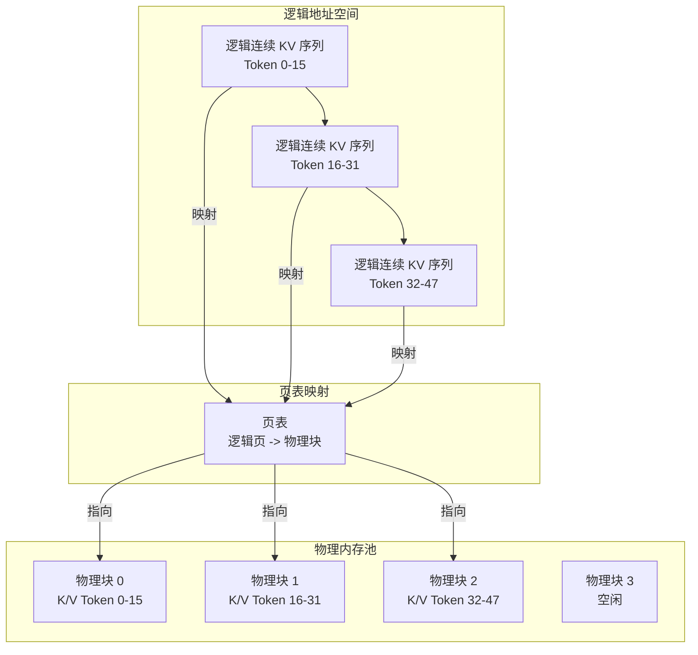
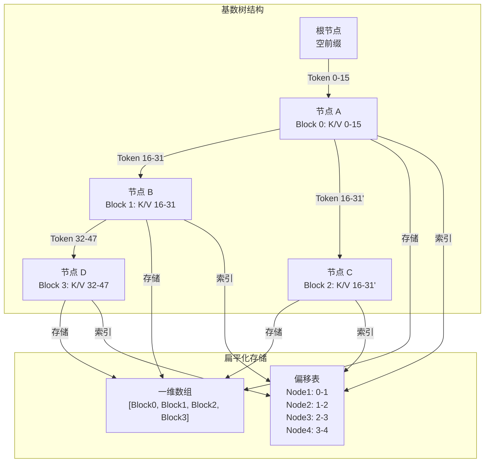

# vLLM 与 SGLang KV Cache 实现对比与分析KV Cache

### 一、vLLM Page Attention KV Cache 实现逻辑

**核心思想**：借鉴操作系统虚拟内存管理机制，将 KV Cache 分割为固定大小的“页（Block）”，实现物理内存非连续存储与高效复用。

#### 关键设计：

1. **分页内存布局**

    - KV Cache 被分割为固定大小的块（通常 16/32/64 tokens/block），键（K）和值（V）分别存储在独立的块池中

    - 逻辑上连续的 KV 序列，在物理内存中通过页表（Page Table）映射到非连续的物理块

    - 支持动态分配/回收块，内存利用率接近零浪费

2. **前缀缓存（Prefix Caching）**

    - 不同请求的相同前缀共享 KV 块，通过块哈希（block_hash）匹配复用

    - 新请求到达时，从左到右枚举块，查找最长缓存命中前缀，仅计算缺失部分

3. **混合 KV Cache 管理器**

    - 统一内存池支持全注意力（Full Attention）和滑动窗口（Sliding Window）等多种注意力类型

    - 按层分配块数量，通过 `tuple(block_hash, group_id)` 缓存完整块，不同组独立缓存与淘汰

### 二、SGLang Radix Attention KV Cache 实现逻辑

**核心思想**：用基数树（Radix Tree）组织 KV Cache，树形结构存储共享前缀，GPU 友好的扁平化设计实现高效复用。

#### 关键设计：

1. **基数树存储结构**

    - 树节点代表 token 序列路径，相同前缀共享树节点，避免重复存储

    - 不使用指针树（GPU 随机访问慢），而是将树编码为**一维数组 + 偏移表**，每个节点记录子节点起始位置和长度，用连续内存访问替代随机跳转

2. **按块调度与动态管理**

    - KV 缓存切分为固定大小块（默认 16 token/block），每个块对应树上一个子路径

    - 新请求到达时，实时计算与现有路径的**最长公共前缀（LCP）**，自动复用命中块；无访问的分支块标记为可回收

3. **GPU 优化**

    - 扁平化树结构 + 连续内存访问，充分利用 GPU 显存带宽

    - 典型客服对话负载下，KV 缓存平均复用深度达 5.2 层，显存占用降低 37%，kernel launch 次数减少 58%

### 三、Mermaid 图示

#### 1. vLLM Page Attention 内存布局


#### 2. SGLang Radix Attention 树形缓存


### 四、代码示例

#### 1. vLLM Paged Attention 简化逻辑（Python 伪代码）

```Python

class PagedAttentionCache:
    def __init__(self, block_size=16, num_blocks=1024):
        self.block_size = block_size
        self.k_cache_pool = [None] * num_blocks  # 物理 K 块池
        self.v_cache_pool = [None] * num_blocks  # 物理 V 块池
        self.page_table = {}  # 逻辑页 -> 物理块映射
        self.free_blocks = list(range(num_blocks))  # 空闲块列表

    def allocate(self, logical_pages):
        """为逻辑页分配物理块"""
        physical_blocks = []
        for page in logical_pages:
            if page in self.page_table:
                physical_blocks.append(self.page_table[page])
            else:
                if not self.free_blocks:
                    raise RuntimeError("Out of memory")
                block = self.free_blocks.pop()
                self.page_table[page] = block
                physical_blocks.append(block)
        return physical_blocks

    def attention_kernel(self, q, k_cache, v_cache, block_indices):
        """简化的分页注意力 kernel：从非连续块读取 KV 并计算注意力"""
        output = []
        for i, block_idx in enumerate(block_indices):
            # 从物理块读取 K/V
            k = k_cache[block_idx * self.block_size : (block_idx + 1) * self.block_size]
            v = v_cache[block_idx * self.block_size : (block_idx + 1) * self.block_size]
            # 计算注意力（简化点积）
            attn = q[i] @ k.T
            output.append(attn @ v)
        return output
```

#### 2. SGLang Radix Cache 简化逻辑（Python 伪代码）

```Python

class RadixTreeNode:
    def __init__(self, key, value=None):
        self.key = key  # token 序列片段
        self.value = value  # KV 缓存块
        self.children = {}  # 子节点: {token_suffix: node}

class RadixCache:
    def __init__(self, block_size=16):
        self.root = RadixTreeNode(key=[])
        self.block_size = block_size

    def match_prefix(self, tokens):
        """查找最长公共前缀，返回命中节点和剩余 token"""
        node = self.root
        matched_len = 0
        while matched_len < len(tokens):
            suffix = tuple(tokens[matched_len : matched_len + self.block_size])
            if suffix in node.children:
                node = node.children[suffix]
                matched_len += self.block_size
            else:
                break
        return node, matched_len, tokens[matched_len:]

    def insert(self, tokens, kv_block):
        """插入新的 KV 块到基数树"""
        node, matched_len, remaining = self.match_prefix(tokens)
        while remaining:
            suffix = tuple(remaining[: self.block_size])
            new_node = RadixTreeNode(key=suffix, value=kv_block[matched_len : matched_len + self.block_size])
            node.children[suffix] = new_node
            node = new_node
            matched_len += self.block_size
            remaining = remaining[self.block_size :]
```

### 总结对比

|特性|vLLM Page Attention|SGLang Radix Attention|
|---|---|---|
|数据结构|页表 + 物理块池|基数树（扁平化一维数组）|
|前缀复用粒度|块级（固定大小）|路径级（动态最长公共前缀）|
|GPU 访问模式|页表映射后随机访问|连续内存访问（偏移表索引）|
|适用场景|通用高吞吐推理|多轮对话、共享前缀多的结构化生成|