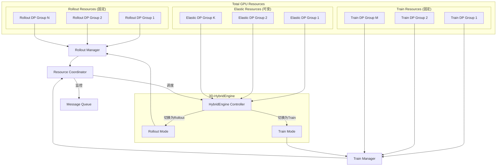
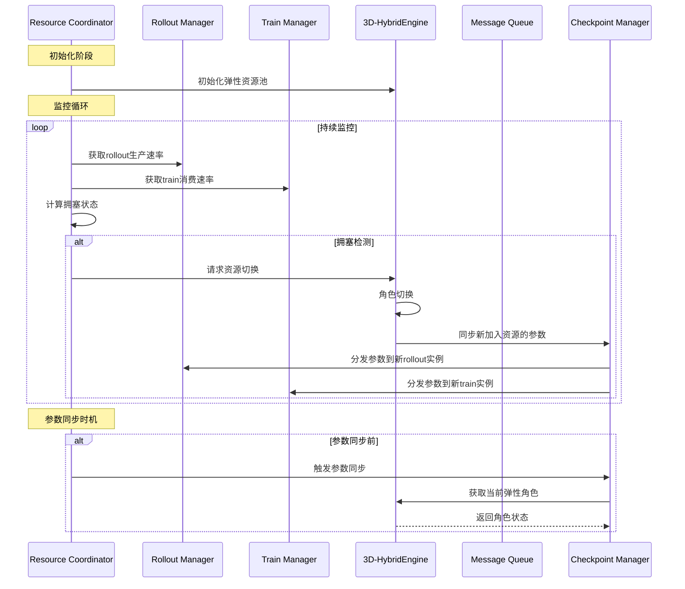
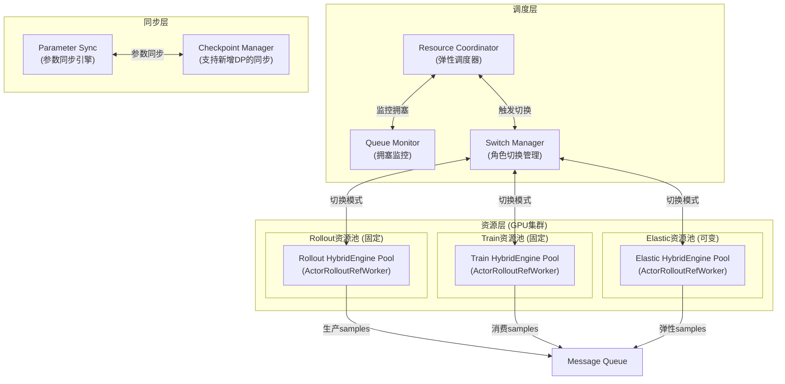

# 弹性Rollout与训练调度系统设计方案

## 1. 整体架构设计

### 1.1 资源划分

### 1.2 核心数据流

### 1.3 架构设计

## 3. 实施计划

### Phase 1: 核心框架 (1-2周)

1. 创建 `verl/experimental/elastic_scheduling/` 目录结构
2. 实现 `ElasticResourceManager` - 资源管理
3. 实现 `CongestionMonitor` - 拥塞监控
4. 实现 `ResourceCoordinator` - 调度协调

### Phase 2: Rollouter/Trainer集成 (2-3周)

1. 实现 `ElasticRollouter` - 继承FullyAsyncRollouter
2. 实现 `ElasticTrainer` - 继承FullyAsyncTrainer
3. 实现 `ElasticCheckpointManager` - 参数同步

### Phase 3: 引擎集成 (2周)

1. 支持FSDP2的动态DP切换
2. 支持Megatron的动态DP切换
3. 集成3D-HybridEngine

### Phase 4: 测试与优化 (1-2周)

1. 单元测试
2. 集成测试
3. 性能优化

## 4. 关键设计决策

### 4.1 为什么基于ActorRolloutRefWorker?

- 它已经是成熟的HybridEngine实现
- 支持FSDP2和Megatron后端
- 有完整的参数同步机制
- 可以在rollout和train模式间切换

### 4.2 DP通讯组处理

对于FSDP2:

- 利用 `veomni.distributed.parallel_state` 动态调整DP大小
- 保持TP/EP不变

对于Megatron:

- 调用 `mpu.destroy_model_parallel()` 重建
- 需要协调多个PP stage

### 4.3 参数同步策略

- 使用现有的 `CheckpointEngine` 架构
- 支持增量同步（只同步变化部分）
- 对于新增DP，广播完整参数

