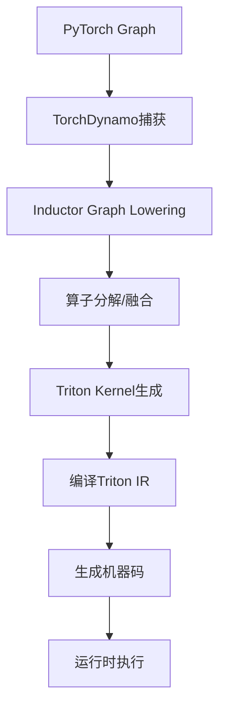
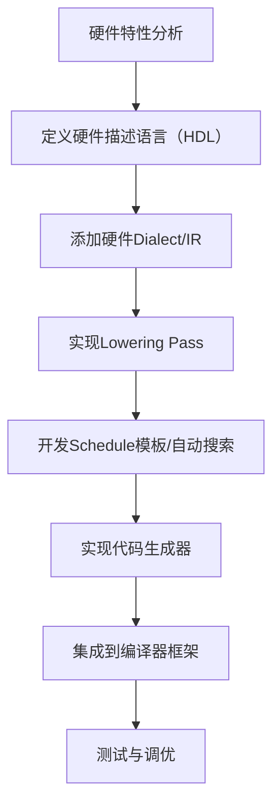

# 编译器优化核心问题解答：TensorRT、TVM、MLIR

### 编译器优化核心问题解答

以下针对你提出的15个编译器优化核心问题逐一解答，覆盖TVM/MLIR/TensorRT等框架、编译优化技术、工程实践等维度，兼顾概念解释与落地方法。

---

#### 31. TVM的Ansor和MetaSchedule的区别？如何搜索最优schedule？

##### 核心区别

|维度|Ansor|MetaSchedule|
|---|---|---|
|设计定位|第一代自动调度器，基于模板+进化搜索|第二代自动调度器，无模板+元学习|
|搜索空间|人工定义的模板化搜索空间（有限）|动态生成的无模板搜索空间（灵活）|
|搜索策略|进化搜索+贝叶斯优化|采样+代价模型+遗传算法+元学习|
|硬件适配性|依赖人工模板，新硬件适配成本高|自动适配，新硬件只需定义硬件特征|
|性能/效率权衡|搜索速度快，但最优性受限|搜索时间长，但更接近理论最优|
##### 搜索最优schedule的通用流程

1. **定义搜索空间**：

    - Ansor：基于`ComputeDAG`和人工编写的`ScheduleRule`（如拆分、平铺、向量化规则）；

    - MetaSchedule：通过`SpaceGenerator`动态生成搜索空间，结合硬件原语（如缓存大小、向量宽度）约束。

2. **搜索策略执行**：

    - 初始化：随机采样少量schedule作为初始种群；

    - 迭代优化：通过进化算法（交叉/变异）生成新schedule，结合代价模型（如延迟预测）筛选优质候选；

    - 验证：在真实硬件上编译并运行候选schedule，获取实际性能。

3. **结果固化**：将最优schedule序列化存储，后续编译时直接复用。

---

#### 32. MLIR的设计哲学是什么？`dialect`、`operation`、`pass`的概念？

##### 设计哲学

1. **分层抽象（Multi-Level）**：拒绝“大一统IR”，通过多层IR适配不同编译阶段（如前端表达、优化、硬件生成），每层IR只关注特定语义，降低优化复杂度；

2. **可扩展（Extensible）**：支持自定义dialect/operation，适配新硬件/新算子，无需修改核心框架；

3. **渐进式转换（Progressive Lowering）**：将复杂的端到端编译拆解为多个小步转换，每一步只做单一语义的降低/优化，便于调试和维护；

4. **统一基础设施**：所有dialect共享类型系统、分析工具、pass管理器等核心组件，避免重复造轮子。

##### 核心概念

1. **Dialect（方言）**：

    - 定义：一组相关的`operation`、类型、属性和验证规则的集合，是MLIR的“语义域”；

    - 作用：隔离不同层级/领域的语义（如`tensor` dialect处理张量、`llvm` dialect对接LLVM IR、`triton` dialect适配Triton核）；

    - 示例：`tosa`（TOSA标准）、`lhlo`（XLA HLO lowering）、`gpu`（GPU抽象）。

2. **Operation（操作）**：

    - 定义：MLIR的核心执行单元，描述一个计算/逻辑行为（如加法、卷积、内存分配）；

    - 构成：包含名称（如`tensor.add`）、输入/输出、属性（常量参数，如卷积核大小）、类型约束、验证逻辑；

    - 特点：可自定义，支持重载，是dialect的基本组成单元。

3. **Pass（优化过程）**：

    - 定义：对IR进行单一逻辑转换的模块化组件（如算子融合、常量折叠、循环优化）；

    - 作用：实现编译优化的最小单元，可组合、可复用、可调试；

    - 类型：分析型pass（如依赖分析）、转换型pass（如lowering、优化）。

---

#### 33. TorchInductor如何将PyTorch graph编译成Triton kernel？

##### 核心流程（简化版）


1. **Step 1：Graph捕获（TorchDynamo）**

TorchDynamo通过Python字节码分析，捕获PyTorch的`nn.Module`或函数的计算图，跳过Python动态逻辑，输出静态的FX Graph。

1. **Step 2：Graph Lowering（Inductor核心）**

    - 将FX Graph转换为Inductor的中间表示（基于`aten`算子）；

    - 执行图优化：常量折叠、算子融合（如Conv+BN）、死代码消除。

2. **Step 3：算子映射与分解**

    - 将高层`aten`算子分解为Inductor的“虚拟算子”（如`pointwise`、`reduction`、`conv`）；

    - 根据硬件特性（如GPU架构）选择最优的算子实现模板。

3. **Step 4：Triton Kernel生成**

    - 针对每个虚拟算子，根据张量形状、数据类型、硬件参数（如block size）生成Triton Python代码；

    - 自动优化：循环分块（tiling）、共享内存分配、线程映射、向量化。

4. **Step 5：编译与执行**

    - Triton编译器将Triton代码编译为LLVM IR，再通过NVCC/Clang编译为CUDA PTX/机器码；

    - Inductor生成调用这些kernel的Python绑定，运行时直接调用。

##### 关键优化点

- 自动调优：针对不同张量形状，通过`triton.autotune`搜索最优的block size、tiling size；

- 内存优化：复用显存缓冲区，减少H2D/D2H拷贝；

- 融合优化：将多个逐点算子（如add+relu）融合为单个Triton kernel，减少kernel launch开销。

---

#### 34. ONNX Runtime的图优化有哪些？`constant folding`、`operator fusion`等

##### ONNX Runtime核心图优化分类

|优化类型|作用|
|---|---|
|**常量折叠（Constant Folding）**|编译时计算常量算子（如`Constant`+`Add`）的结果，替换为常量，减少运行时计算|
|**算子融合（Operator Fusion）**|将多个连续算子合并为单个算子（如Conv+BN+Relu、MatMul+Add），减少kernel launch和内存访问|
|**死代码消除（DCE）**|删除无输出依赖的算子（如未使用的`Print`、冗余的`Identity`）|
|**算子替换（Operator Replacement）**|将高层算子替换为更高效的底层算子（如`Gather`替换为`Slice`）|
|**形状推断（Shape Inference）**|推导所有张量的形状，为后续优化（如静态shape优化）提供依据|
|**布局优化（Layout Optimization）**|调整张量存储布局（如NHWC↔NCHW），适配硬件最优访问模式|
|**量化优化（Quantization Optimization）**|融合量化/反量化算子，优化低精度计算流程|
|**并行化优化（Parallelization）**|标记可并行执行的算子，运行时多线程调度|
##### 关键优化详解

1. **Constant Folding**：

    - 示例：`Constant(5) + Constant(3)` → 直接替换为`Constant(8)`；

    - 边界：仅处理纯常量计算，避免副作用算子（如`RandomNormal`）。

2. **Operator Fusion**：

    - 规则：基于算子的输入输出依赖、数据类型、硬件支持（如CUDA核心支持的融合模式）；

    - 示例：ONNX Runtime的`ConvBNFusion` pass将Conv、BatchNorm、Relu融合为单个`FusedConv`算子，减少内存读写。

3. **分阶段优化**：

ONNX Runtime将图优化分为三级：

- Level 0：禁用所有优化；

- Level 1：基础优化（常量折叠、DCE）；

- Level 2：高级优化（算子融合、布局优化）；

- Level 3：针对特定硬件的优化（如TensorRT/DNNL融合）。

---

#### 35. TensorRT的plugin开发流程？如何支持dynamic shape？

##### TensorRT Plugin开发核心流程

1. **Step 1：定义Plugin接口**

继承TensorRT的`IPluginV2DynamicExt`（推荐，支持dynamic shape）或`IPluginV2`（静态shape），实现核心接口：

- `getOutputDimensions`：推导输出张量形状；

- `initialize`：初始化资源（如权重加载）；

- `enqueue`：实现算子的CUDA/CPU计算逻辑；

- `serialize/deserialize`：序列化/反序列化plugin参数。

1. **Step 2：实现Plugin Creator**

继承`IPluginCreator`，实现：

- `createPlugin`：创建plugin实例；

- `getFieldNames`：定义plugin的可配置参数（如核大小、步长）；

- `deserializePlugin`：从序列化数据恢复plugin。

1. **Step 3：注册Plugin**

通过`REGISTER_TENSORRT_PLUGIN`宏注册creator，使TensorRT能发现并加载plugin。

1. **Step 4：编译与测试**

    - 编译为动态库（.so/.dll）；

    - 在TensorRT构建阶段加载plugin，构建engine并验证精度/性能。

##### 支持Dynamic Shape的关键要点

1. **接口选择**：必须使用`IPluginV2DynamicExt`（而非旧的`IPluginV2`），其接口支持动态形状推导；

2. **形状约束**：

    - 在`getOutputDimensions`中，通过`DimsExprs`（表达式）而非固定`Dims`推导输出形状（如`output_h = (input_h - kernel_h) / stride + 1`）；

    - 在`configurePlugin`中验证输入形状的合法性（如动态维度的范围）。

3. **内存分配**：

    - 避免静态分配显存，在`enqueue`中根据实际输入形状动态计算所需内存；

    - 使用TensorRT的`IExecutionContext`获取当前批次的实际形状。

4. **序列化**：

    - 序列化时保存动态维度的约束（如min/max/opt shape），而非固定值；

    - 反序列化时恢复这些约束，确保engine支持动态形状。

---

#### 36. 解释`loop tiling`、`loop unrolling`、`vectorization`在编译器优化中的作用

##### 核心概念与作用

|优化技术|定义|核心作用|
|---|---|---|
|**Loop Tiling（循环分块）**|将大循环拆分为多个小循环（tile），使计算数据适配硬件缓存（Cache）大小|减少Cache Miss，提升数据局部性；适配硬件并行粒度（如GPU的block/thread）|
|**Loop Unrolling（循环展开）**|将循环体重复多次，减少循环控制（如条件判断、计数器递增）的开销|降低循环迭代的指令开销；暴露更多指令级并行（ILP），便于编译器调度|
|**Vectorization（向量化）**|将标量运算转换为向量运算（如SIMD指令），单次处理多个数据|利用CPU/GPU的向量寄存器，提升计算吞吐量；减少内存访问次数|
##### 示例（CPU端优化）

```C++

// 原始代码（矩阵乘法内层循环）
for (int i = 0; i < N; i++) {
  C[i] += A[i] * B[i];
}

// 优化后（Tiling + Unrolling + Vectorization）
// Tiling：将N拆分为16的倍数（适配L1 Cache）
for (int i = 0; i < N; i += 16) {
  // Unrolling：展开4次循环，减少i++和条件判断
  // Vectorization：使用AVX2指令（256位），单次处理8个float
  __m256 a0 = _mm256_loadu_ps(&A[i]);
  __m256 b0 = _mm256_loadu_ps(&B[i]);
  __m256 c0 = _mm256_loadu_ps(&C[i]);
  c0 = _mm256_fmadd_ps(a0, b0, c0); // 融合乘加（FMA）
  _mm256_storeu_ps(&C[i], c0);

  __m256 a1 = _mm256_loadu_ps(&A[i+8]);
  __m256 b1 = _mm256_loadu_ps(&B[i+8]);
  __m256 c1 = _mm256_loadu_ps(&C[i+8]);
  c1 = _mm256_fmadd_ps(a1, b1, c1);
  _mm256_storeu_ps(&C[i+8], c1);
}
```

---

#### 37. 量化编译中的`PTQ`和`QAT`在编译器层面如何处理？

##### 核心概念回顾

- **PTQ（Post-Training Quantization）**：训练后量化，基于校准数据集调整量化参数（如缩放因子、零点），无需重新训练；

- **QAT（Quantization-Aware Training）**：训练时量化，在正向/反向传播中模拟量化误差，提升量化模型精度。

##### 编译器层面处理

|阶段|PTQ处理逻辑|QAT处理逻辑|
|---|---|---|
|**图分析**|识别可量化算子（如Conv、MatMul），标记输入/输出的量化位宽（如int8）|识别带量化伪节点的算子（QAT训练时插入的QuantStub/DeQuantStub），保留量化参数|
|**量化参数推导**|运行校准数据集，统计张量的min/max，计算缩放因子（scale）和零点（zero_point）|直接读取训练时固化的量化参数（scale/zero_point），无需校准|
|**算子替换**|将浮点算子替换为量化算子（如ConvFP32→ConvINT8），插入量化/反量化节点|移除训练时的伪量化节点，替换为真实量化算子，保留训练优化的权重|
|**图优化**|融合量化/反量化节点与计算算子（如Quant+Conv→QuantConv）|融合伪量化节点与计算算子，优化量化后的计算流程|
|**硬件适配**|生成适配硬件量化指令的代码（如CPU的VNNI、GPU的TensorCore）|同PTQ，优先使用硬件原生量化指令|
##### 关键差异

- PTQ：编译器需额外执行“校准”步骤推导量化参数，精度依赖校准数据集；

- QAT：编译器直接复用训练阶段的量化参数，无需校准，精度更高，编译流程更简单。

---

#### 38. 稀疏化（sparsity）如何被编译器利用？`2:4 structured sparsity`的硬件支持？

##### 编译器利用稀疏性的核心方式

1. **稀疏检测与表征**：

    - 检测：识别张量/权重中的稀疏模式（结构化/非结构化）；

    - 表征：用稀疏格式（如CSR、CSC、COO，或结构化掩码）存储稀疏数据，减少内存占用。

2. **稀疏计算优化**：

    - 跳过零值计算：编译时生成条件分支，只处理非零元素，减少计算量；

    - 算子融合：将稀疏掩码应用与计算算子融合，避免额外的掩码操作；

    - 内存优化：加载数据时只读取非零元素，减少内存带宽消耗。

3. **硬件指令适配**：

    - 生成调用硬件稀疏指令的代码（如NVIDIA的TensorCore稀疏指令、Intel的AMX稀疏指令）；

    - 调整数据布局，适配硬件稀疏计算的要求。

##### 2:4 Structured Sparsity（2:4结构化稀疏）

1. **定义**：每4个连续元素中恰好有2个非零元素，其余2个为零，是NVIDIA Ampere及以上架构支持的结构化稀疏模式。

2. **硬件支持**：

    - NVIDIA GPU：TensorCore支持2:4稀疏模式，稀疏计算时吞吐量提升2倍（无需额外计算零值）；

    - 硬件约束：稀疏掩码需按4元素粒度对齐，非零元素位置需符合硬件要求；

    - 指令集：通过`wmma`（Warp Matrix Multiply-Accumulate）指令集的稀疏版本调用TensorCore稀疏计算。

3. **编译器处理**：

    - 验证：检查权重是否符合2:4稀疏模式，不符合则自动调整（如填充零值）；

    - 掩码生成：生成2:4稀疏掩码，与权重一起存储；

    - 代码生成：调用TensorCore稀疏指令，实现高效的稀疏矩阵乘法。

---

#### 39. 编译器的pass manager如何工作？`top-down` vs `bottom-up`遍历？

##### Pass Manager（Pass管理器）核心工作流程

1. **Pass注册与排序**：

    - 用户/编译器注册需要执行的pass，指定pass的依赖关系（如A pass需在B pass之后执行）；

    - Pass manager根据依赖关系和优化级别，生成pass执行顺序。

2. **IR遍历与转换**：

    - 遍历IR的节点（如operation、loop、function），对每个节点执行pass的逻辑；

    - 维护IR的完整性，确保转换后IR符合语义规则（如类型检查、合法性验证）。

3. **Pass通信与状态管理**：

    - 通过分析结果缓存（如依赖分析、形状分析）在pass间共享信息；

    - 支持pass的嵌套执行（如函数内的子pass）。

4. **优化验证与回退**：

    - 验证转换后的IR是否正确，若出现错误则回退到上一版本；

    - 统计优化收益（如计算量减少、内存访问减少）。

##### Top-Down vs Bottom-Up遍历

|遍历方式|执行顺序|适用场景|示例|
|---|---|---|---|
|**Top-Down**|从IR根节点（如module）开始，逐层向下遍历子节点（如function、operation）|全局优化（如模块级死代码消除、全局常量传播）|MLIR的ModulePass、全局形状推断|
|**Bottom-Up**|从IR叶子节点（如operation）开始，逐层向上遍历父节点（如loop、function）|局部优化（如算子融合、循环优化）|MLIR的FunctionPass、循环tiling|
##### 示例（MLIR Pass Manager）

```C++

// 创建Pass Manager
mlir::PassManager pm(ctx);
// 添加Bottom-Up Pass（函数内循环优化）
pm.addPass(mlir::createLoopTilingPass());
// 添加Top-Down Pass（模块级常量折叠）
pm.addPass(mlir::createConstantFoldingPass());
// 运行Pass
if (failed(pm.run(module))) {
  // 处理错误
}
```

---

#### 40. 如何为新的硬件后端添加编译器支持？以自定义AI芯片为例

##### 核心流程（以TVM为例）


1. **Step 1：硬件特性分析**

梳理自定义AI芯片的核心特性：

- 计算单元：支持的算子（如Conv、MatMul）、数据类型（如FP16、INT8）、并行粒度（如SIMD宽度、计算核心数）；

- 存储层次：缓存大小、内存带宽、数据布局要求（如NHWC/NCHW）；

- 指令集：自定义指令（如稀疏计算、量化计算）、指令格式。

1. **Step 2：定义硬件描述语言（HDL）**

用TVM的`Target`或MLIR的`TargetAttr`定义硬件参数：

```Python

# TVM自定义Target
my_target = tvm.target.Target(
    "my_ai_chip",
    host="llvm",
    cache_size=1024*1024,  # L1缓存大小
    simd_width=16,         # SIMD宽度
    tensor_core=True       # 是否支持TensorCore
)
```

1. **Step 3：添加硬件IR/Dialect**

    - TVM：自定义`TensorExpression`或`Schedule`原语，描述硬件支持的操作；

    - MLIR：自定义dialect（如`my_chip` dialect），定义硬件支持的operation和类型。

2. **Step 4：实现Lowering Pass**

将高层IR（如ONNX/TVM IR）转换为硬件原生IR：

- 算子映射：将高层算子（如Conv）映射为硬件原生算子（如`my_chip.conv2d`）；

- 形状调整：适配硬件的张量布局和并行粒度；

- 量化/稀疏适配：转换为硬件支持的量化/稀疏格式。

1. **Step 5：Schedule开发**

    - 手动编写Schedule模板：针对硬件特性优化循环分块、数据布局、指令选择；

    - 自动搜索：基于Ansor/MetaSchedule，定义硬件代价模型，搜索最优Schedule。

2. **Step 6：代码生成器**

将硬件IR转换为芯片的机器码/汇编/配置文件：

- 生成硬件指令序列；

- 配置硬件资源（如计算核心、内存带宽）。

1. **Step 7：集成与测试**

    - 将新后端集成到编译器框架（如TVM的`codegen`模块、MLIR的`translation`模块）；

    - 测试：验证功能正确性（精度）、性能（吞吐量/延迟）、稳定性。

---

#### 41. Apache TVM vs MLIR vs TorchDynamo，技术路线差异？

|维度|Apache TVM|MLIR|TorchDynamo|
|---|---|---|---|
|**定位**|端到端的深度学习编译器，聚焦异构硬件部署|通用多层IR框架，聚焦编译基础设施|PyTorch动态图捕获工具，聚焦前端图提取|
|**核心目标**|自动优化并生成适配异构硬件的高效代码|提供统一的多层IR和编译工具链|解决PyTorch动态图编译的“捕获”问题|
|**IR设计**|单一IR（Relay IR + Tensor Expression）+ Schedule系统|多层IR（Dialect），渐进式Lowering|无独立IR，复用PyTorch FX Graph|
|**优化方式**|基于Schedule的自动搜索（Ansor/MetaSchedule）|基于Pass的模块化优化|图捕获后交给后端（如Inductor/TensorRT）优化|
|**硬件适配**|内置多种硬件后端，支持自定义Schedule|自定义Dialect适配新硬件|依赖后端硬件支持，自身不处理硬件适配|
|**生态集成**|支持ONNX/TensorFlow/PyTorch输入|作为基础设施被TVM/TensorFlow/XLA集成|深度集成PyTorch，仅支持PyTorch输入|
---

#### 42. 编译时优化和运行时优化的权衡？`AOT` vs `JIT`？

##### 编译时（Compile-Time）vs 运行时（Runtime）优化

|维度|编译时优化|运行时优化|
|---|---|---|
|**优化时机**|程序执行前（离线）|程序执行中（在线）|
|**可用信息**|静态信息（如张量形状、算子类型）|动态信息（如实际输入形状、硬件负载）|
|**优化目标**|最大化静态性能，减少运行时开销|适配动态场景，提升灵活性|
|**开销**|编译时间长，运行时开销小|编译时间短，运行时可能有额外开销|
|**示例**|循环tiling、算子融合、常量折叠|动态shape适配、硬件负载均衡、即时编译|
##### 权衡原则

1. **静态信息充足**：优先编译时优化（如固定shape的模型推理）；

2. **动态信息关键**：需结合运行时优化（如动态batch size、动态输入形状）；

3. **编译时间敏感**：减少编译时优化的复杂度，部分优化延迟到运行时；

4. **性能敏感**：最大化编译时优化，运行时仅做必要的适配。

##### AOT（Ahead-of-Time）vs JIT（Just-in-Time）

|维度|AOT|JIT|
|---|---|---|
|**编译时机**|离线编译（如模型部署前）|运行时编译（如模型首次执行时）|
|**输出产物**|机器码/可执行文件|临时机器码/中间码|
|**优点**|运行时无编译开销，性能稳定|可利用运行时信息优化，灵活性高|
|**缺点**|不支持动态信息，适配性差|首次执行有编译延迟，运行时开销大|
|**适用场景**|固定shape、高性能要求的部署场景（如服务器推理）|动态shape、快速迭代的场景（如训练、移动端动态输入）|
|**示例**|TensorRT AOT编译、TVM静态编译|PyTorch JIT、ONNX Runtime JIT、Triton JIT|
---

#### 43. 如何处理编译器的编译时间过长问题？缓存策略？

##### 编译时间过长的核心原因

1. 自动调度搜索（如Ansor/MetaSchedule）遍历大量候选Schedule；

2. 多层IR转换（如MLIR的Progressive Lowering）执行大量Pass；

3. 重复编译相同的算子/子图；

4. 硬件适配时的大量性能测试。

##### 优化策略

1. **缓存策略（核心）**

    - **算子级缓存**：缓存编译后的算子代码/二进制，相同算子（形状、类型、硬件）直接复用；

    示例：TVM的`Module`缓存、TorchInductor的Triton kernel缓存；

    - **Schedule缓存**：缓存自动搜索得到的最优Schedule，避免重复搜索；

    示例：TVM的`JSON`格式Schedule缓存、MetaSchedule的`Database`；

    - **IR优化结果缓存**：缓存Pass执行后的IR，避免重复执行优化；

    示例：MLIR的Pass结果缓存、ONNX Runtime的图优化缓存。

2. **编译并行化**

    - 多线程/多进程并行编译不同算子/子图；

    - 分布式搜索（如MetaSchedule的分布式搜索），加速Schedule搜索。

3. **搜索空间剪枝**

    - 基于硬件特性缩小Schedule搜索空间（如只搜索适配硬件缓存的tiling size）；

    - 早期终止：搜索过程中若找到足够优的Schedule，提前终止搜索。

4. **分层编译**

    - 冷编译：首次编译时执行基础优化，快速生成可执行代码；

    - 热编译：后台异步执行高级优化（如自动调度），优化完成后替换旧代码。

##### 缓存实现示例（TVM）

```Python

import tvm
from tvm import meta_schedule as ms

# 1. 配置Schedule缓存数据库
db = ms.database.JSONDatabase(
    path_workload="./workload_cache.json",
    path_tuning_record="./tuning_cache.json"
)

# 2. 编译时优先从缓存加载
target = tvm.target.Target("cuda")
with ms.Profiler() as profiler:
    sch = ms.tune_tir(
        mod=my_mod,
        target=target,
        database=db,
        max_trials_global=1000,  # 若缓存存在，实际执行次数远小于该值
    )

# 3. 缓存复用（后续编译）
sch = ms.tune_tir(
    mod=my_mod,
    target=target,
    database=db,
    max_trials_global=0,  # 仅使用缓存，不执行新搜索
)
```

---

#### 44. `operator decomposing`和`operator fusion`的边界在哪里？

##### 核心概念

- **Operator Decomposing（算子分解）**：将复杂算子拆分为多个简单算子（如ConvTranspose→Conv+Reshape、LayerNorm→Reduce+Broadcast+Add）；

- **Operator Fusion（算子融合）**：将多个简单算子合并为单个复杂算子（如Conv+BN+Relu→FusedConvBNRelu）。

##### 分解与融合的边界原则

1. **硬件支持边界**

    - 融合：硬件支持的算子可直接融合（如GPU的TensorCore支持Conv+BN融合）；

    - 分解：硬件不支持的复杂算子需分解为硬件支持的简单算子（如自定义AI芯片不支持LayerNorm，需分解为Reduce/Broadcast）。

2. **性能权衡边界**

    - 融合收益 > 开销：融合（如减少kernel launch、内存访问）；

    - 融合收益 < 开销：分解（如融合后算子过于复杂，导致寄存器不足、并行度下降）。

3. **语义边界**

    - 融合：算子间无副作用、数据依赖连续（如A的输出是B的输入，无其他依赖）；

    - 分解：算子包含复杂控制流（如if/while）、副作用（如随机数生成），无法安全融合。

4. **调试/维护边界**

    - 分解：调试阶段，将复杂算子分解为简单算子，便于定位问题；

    - 融合：部署阶段，融合简单算子，提升性能。

##### 示例：边界判断

|场景|选择分解/融合|原因|
|---|---|---|
|Conv + BN + Relu（GPU）|融合|GPU支持融合，减少kernel launch和内存访问|
|LayerNorm（自定义AI芯片）|分解|芯片不支持原生LayerNorm，分解为Reduce/Broadcast/Add可利用硬件指令|
|Conv + Dropout|不融合|Dropout有随机数生成（副作用），融合可能导致精度问题|
|MatMul + Add + Relu（CPU）|融合|CPU的AVX2指令支持融合，提升向量计算效率|
|ComplexGEMM（无硬件支持）|分解|分解为RealGEMM+ImagGEMM，利用硬件GEMM指令|
---

#### 45. 编译器如何处理control flow（if/while）？`tracing` vs `symbolic execution`？

##### 编译器处理Control Flow的核心方式

1. **静态展开**：

    - 对固定次数的循环（如`for i in range(10)`），直接展开为多次重复的计算，消除循环控制；

    - 对简单条件分支（如`if x > 0`，x为常量），编译时判断分支方向，删除无效分支。

2. **动态生成**：

    - 对动态循环/分支（如`while x < y`，x/y为变量），生成对应的机器码分支/循环指令；

    - 适配硬件的分支预测、循环流水线优化。

3. **特殊处理（深度学习编译器）**：

    - 将control flow转换为数据流（如用`where`算子替代if-else）；

    - 对动态shape的control flow，生成适配动态维度的代码。

##### Tracing vs Symbolic Execution

|维度|Tracing（追踪）|Symbolic Execution（符号执行）|
|---|---|---|
|**核心思想**|执行一次代码，记录执行过的算子和数据依赖|不执行代码，用符号变量表示输入，推导所有可能的执行路径|
|**Control Flow处理**|只能捕获执行过的分支，丢失未执行分支|捕获所有可能的分支，保留完整的control flow|
|**精度**|低（丢失部分control flow）|高（保留完整control flow）|
|**开销**|低（仅执行一次）|高（推导所有路径）|
|**适用场景**|静态图、无动态control flow的模型|动态图、含复杂control flow的模型|
|**示例**|PyTorch FX Tracing、TensorFlow Tracing|PyTorch TorchScript、MLIR SymbolicShape|
##### 示例（PyTorch Tracing vs Symbolic Execution）

```Python

import torch

# 含control flow的函数
def my_func(x):
    if x.sum() > 0:
        return x * 2
    else:
        return x + 1

# 1. Tracing（仅捕获执行过的分支）
x = torch.ones(2, 2)  # sum=4>0，执行x*2分支
traced = torch.jit.trace(my_func, (x,))
print(traced.graph)  # 仅包含x.sum()和x*2，丢失x+1分支

# 2. Symbolic Execution（捕获所有分支）
scripted = torch.jit.script(my_func)
print(scripted.graph)  # 包含if-else分支，保留完整control flow
```

---

### 总结

1. **编译器优化核心**：围绕“性能-灵活性-编译开销”权衡，静态优化（如算子融合、循环tiling）提升性能，动态优化（如JIT、symbolic execution）提升灵活性，缓存策略降低编译开销。

2. **框架差异**：TVM聚焦异构硬件自动优化，MLIR提供通用多层IR基础设施，TorchDynamo聚焦PyTorch动态图捕获，各有侧重且可互补。

3. **硬件适配关键**：通过自定义IR/dialect、Schedule、plugin适配新硬件，结构化稀疏（如2:4）、量化（PTQ/QAT）需结合硬件原生指令优化。

4. **Control Flow处理**：Tracing轻量但丢失分支，Symbolic Execution完整但开销高，需根据场景选择；算子分解/融合的边界取决于硬件支持和性能权衡。
> （注：文档部分内容可能由 AI 生成）